# 投资项目决策自动化评价系统实验报告

**基于 Python + AI 的多项目批量评估与决策辅助｜第 5 章：NPV、IRR、项目优选、资本分配与敏感性分析**

> 报告生成时间：2026-09-23 23:09:52　｜　基准折现率：10.00%

---

## 一、总体结论

本报告以基准折现率 **10.00%** 对 **6 个测试案例**、共 **31 个投资项目** 完成了 NPV、IRR、年金净流量、盈利能力指数、回收期与 MIRR 的全指标自动化评价，其中 **28 个**项目在基准折现率下可行。

本次共评价 **31 个投资项目**，其中推荐投资 23 个、边缘可行（需谨慎）4 个、IRR 多重根失效（按 NPV 判定）2 个、建议否决 2 个，平均风险评分 **17.7/100**。

**优先推进**：IND-A、MUT-P、MUT-Q、MUT-X、CAP-A、CAP-B、CAP-C、CAP-D、CAP-E、CAP-F、CAP-G、CAP-H、SENS-S、P01、P02、P03、P04、P05、P06、P07、P08、P11、P12。其中 CAP-D（数据中台建设）风险评分最低（0/100），可作为首选投资标的。
**审慎推进**：MUT-Y、SENS-W、P09、P10。这些项目 NPV 为正但安全边际不足 3 个百分点，建议采用分期投入并设置折现率红线，避免一次性全额投入。
**特殊处理**：UNC-A、UNC-B 存在多重 IRR，内部报酬率指标不可用（UNC-B 按 NPV 判定为可行；UNC-A 按 NPV 判定为不可行），决策与考核应以 NPV 与 MIRR 为准。
**建议否决**：IND-B、UNC-C。在既定折现率下无法覆盖资本成本，应释放相应资金用于其他更优用途。

**整体判断**：建议按「风险评分升序 + 资本限额约束」的顺序配置资金，优先满足高安全边际项目的资金需求；对边缘可行项目实行分阶段拨付与里程碑考核，一旦关键假设偏离即触发再评估机制。

### 关键发现

- **CASE-2**：成功复现并解决了互斥项目优选中的两组经典冲突（MUT-LIFE、MUT-SCALE）——规模冲突组揭示 IRR 法在互斥决策中会给出错误信号，须以 NPV 为准并用增量 IRR 验证；寿命冲突组揭示 NPV 在寿命不等时不可直接比较，须改用年金净流量法。

- **CASE-3**：验证了 **排序法（PI 贪心）在资本额度不可分割时失效** —— 排序法得到 1,370 万元并留下 200 万元闲置额度，组合法穷举得到全局最优 1,460 万元（多创造价值 90 万元）。

- **CASE-4**：稳健求解器成功捕获多重 IRR —— UNC-A 存在 2 个 IRR（10.00%、60.00%）；UNC-B 存在 2 个 IRR（5.00%、25.00%），验证了「非常规现金流下 IRR 失效、必须以 NPV 为准」的结论。

- **CASE-5**：识别出边缘可行项目 SENS-W —— 其 IRR 仅高于资本成本不足 2 个百分点，折现率上升 5 个百分点后 NPV 即由正转负，抗风险能力弱，建议分期投入并设置折现率红线。

## 二、评价方法与判据说明

### 2.1 净现值法（NPV）
计算式：`NPV = -I₀ + Σ(t=1..n) CFₜ / (1 + r)ᵗ`

其中 I₀ 为初始投资，CFₜ 为第 t 期净现金流，r 为折现率（资本成本）。
**判据**：NPV > 0 → 项目创造价值，方案可行；NPV ≤ 0 → 方案不可行。
独立项目决策中，NPV 是唯一理论上无缺陷的判据，也是互斥项目优选的首选准则。

### 2.2 内含报酬率法（IRR）
计算式：求解 r 使 `NPV(r) = 0`，该 r 即为 IRR。

本系统采用「网格扫描 + Brent 精解」的数值策略：先在 (-99%, 500%] 区间上
以 2000 点网格扫描 NPV 的符号变化区间，再对每个变号区间用 Brent 法精确定位，
**可同时捕获全部实根**，从而识别多重 IRR 异常情形。

**判据**：IRR > 资本成本 → 方案可行。
**局限**：非常规现金流（多次符号变化）可能导致 IRR 多解甚至无解，
此时 IRR 指标失效，必须以 NPV 为准，并辅以 MIRR（修正内部报酬率）。

### 2.3 年金净流量法（ANCF / 等额年金 EAA）
计算式：`ANCF = NPV / PVIFA(r, n) = NPV × r / [1 - (1 + r)^(-n)]`

**用途**：解决 **寿命期不同的互斥项目** 无法直接比较 NPV 的问题。
该方法把项目总 NPV 折算为「每年等额创造的价值」，使不同寿命的方案
在统一口径下可比。**判据**：ANCF 越大方案越优；ANCF > 0 项目可行。

### 2.4 盈利能力指数与资本限额下的项目分配
计算式：`PI = (NPV + I₀) / I₀`，表示单位投资额创造的现值。

资本限额下求解最优投资组合的三种方法：

1. **排序法**：按 PI 降序贪心装入。速度快，但隐含「资金可任意分割」假设，
   当资本额度不可分割时会因额度碎片化而错过全局最优解；
2. **组合法**：DFS 穷举全部可行组合（配合可行性剪枝与最优性剪枝），
   **保证全局最优**，是本系统的推荐方法；
3. **背包法**：把额度整数化后用 0-1 动态规划求解，复杂度 O(n × Budget)，
   适用于项目数很多、穷举不可行的场景，用于交叉验证组合法结果。

### 2.5 投资决策敏感性分析
分析折现率、初始投资、年现金流、项目寿命四项因素变动对 NPV 的影响：

* **单因素敏感性**：折现率按 **绝对百分点 ±5pp** 扰动，初始投资与年现金流
  按 **相对比例 ±20%** 扰动，寿命按 ±1 年扰动（不同因素口径不同，需标注清楚）；
* **临界点（盈亏平衡）分析**：求解使 NPV = 0 的临界折现率（数值上等于 IRR）、
  初始投资上限、年现金流下限，并换算为「可承受的最大不利变动幅度」；
* **安全边际**：`安全边际 = IRR − 资本成本`，用于量化抗风险能力；
* **双因素联动**：折现率 × 年现金流 二维矩阵，识别可行区与不可行区的分界线。

**tornado 图（旋风图）** 按各因素引起的 NPV 波动幅度降序排列，
条形越长说明该因素越关键；若不利方向的条形越过 NPV = 0 临界线，
则该因素一旦不利变动将直接导致项目失效，属 **致命敏感因素**。

### 2.6 AI 辅助功能
> **关于「AI 生成」的口径说明**：本系统的「AI 生成数据」指 **用行业知识构建参数区间，
> 再由程序在区间内约束采样**，而非由大模型逐条编造现金流数字；「AI 生成建议」指
> **规则引擎产出结论 + 大模型可选润色**。这是刻意的工程取舍，理由见下。

**（1）AI 生成测试数据**：采用「行业原型约束 + 参数化生成」策略，
基于 6 个行业的真实资本投资特征（新能源、半导体、生物医药、消费零售、
公用事业、数字软件）构建参数区间，再按 steady / growth / jcurve / cycle
四种现金流形态生成项目数据，覆盖不同规模（700~9000 万元）、
不同寿命（5~15 年）、不同风险等级。使用固定随机种子，**结果完全可复现**；
该策略避免了直接由大模型自由生成数字所导致的数量级失真与不可复现问题。

**（2）AI 生成决策建议**：采用「规则引擎 + 可选大模型润色」双通道架构。
规则引擎基于 8 类风险规则（安全边际、折现率冲击、投资超支容错、
现金流下滑容错、回收期占比、多重 IRR、现金流波动率、资本集中度）
自动生成带具体数字的结论、风险提示与建议动作，**离线可用、零幻觉、可追溯**；
若配置了大模型 API（`IDS_LLM_API_KEY`），则把已算好的结构化指标作为上下文
交给模型润色表达，并强制约束「不得修改任何数字」。

### 2.7 技术栈
| 组件 | 用途 |
| :--- | :--- |
| Python 3.9+ | 主语言（实测环境 3.9.13）|
| NumPy | 现金流向量化折现计算 |
| SciPy | Brent 法求解 IRR 方程实根 |
| pandas | 数据表组织与 CSV 导出 |
| Matplotlib | 全部图表绘制（含中文字体配置）|
| python-docx | Word 报告生成 |
| AI（规则引擎 + 可选 LLM）| 数据生成与决策文案生成 |

## 三、测试案例详解

## 1. 案例 CASE-1：独立项目可行性评价

**对应知识点**：NPV 与 IRR 双判据的一致性校验；正负对照形成可行性结论

基准折现率：**10.00%**｜项目数量：**2 个**

### 项目基础数据

| 项目编号 | 项目名称 | 所属行业 | 初始投资(万元) | 寿命(年) | 风险等级 | 互斥组 | 现金流符号变化次数 |
|:---:|:---:|:---:|:---:|:---:|:---:|:---:|:---:|
| IND-A | 智能仓储自动化改造 | 智能制造 / 物流 | 1,000.00 | 5 | 中 | - | 1 |
| IND-B | 传统生产线扩建 | 传统制造 | 1,800.00 | 6 | 中高 | - | 1 |

**各期净现金流明细（万元）**

| 项目编号 | 初始投资(万元) | 第1年 | 第2年 | 第3年 | 第4年 | 第5年 | 第6年 |
|:---:|:---:|:---:|:---:|:---:|:---:|:---:|:---:|
| IND-A | 1,000.00 | 280.00 | 300.00 | 320.00 | 340.00 | 360.00 | - |
| IND-B | 1,800.00 | 300.00 | 330.00 | 360.00 | 390.00 | 420.00 | 450.00 |

### 全指标评价结果

| 项目编号 | 项目名称 | 所属行业 | 初始投资(万元) | 寿命期(年) | 折现率 | NPV(万元) | IRR | IRR唯一性 | 年金净流量ANCF(万元) | 盈利能力指数PI | 静态回收期(年) | 动态回收期(年) | MIRR | 可行性 |
|:---:|:---:|:---:|:---:|:---:|:---:|:---:|:---:|:---:|:---:|:---:|:---:|:---:|:---:|:---:|
| IND-A | 智能仓储自动化改造 | 智能制造 / 物流 | 1000.0 | 5 | 10.00% | 198.66 | 17.16% | 唯一 | 52.41 | 1.1987 | 3.29 | 4.11 | 14.06% | 可行 |
| IND-B | 传统生产线扩建 | 传统制造 | 1800.0 | 6 | 10.00% | -202.9 | 6.31% | 唯一 | -46.59 | 0.8873 | 5.0 | 寿命内未收回 | 7.83% | 不可行 |

### 敏感性分析

#### IND-A（智能仓储自动化改造）

基准 NPV **198.66 万元**｜IRR **17.16%**｜安全边际 **+7.16 个百分点**｜抗风险等级「**较强**」

| 影响因素 | 不利变动 | 不利变动后NPV(万元) | 有利变动 | 有利变动后NPV(万元) | NPV波动幅度(万元) | 是否击穿临界点 |
|:---:|:---:|:---:|:---:|:---:|:---:|:---:|
| 年现金流 | 现金流 −20% | -41.07 | 现金流 +20% | 438.39 | 479.46 | ⚠️ 是（NPV 转负） |
| 项目寿命 | 寿命 −1 年 → 4 年 | -24.88 | 寿命 +1 年 → 6 年 | 401.87 | 426.74 | ⚠️ 是（NPV 转负） |
| 初始投资 | 投资 +20% → 1,200 万元 | -1.34 | 投资 −20% → 800 万元 | 398.66 | 400.00 | ⚠️ 是（NPV 转负） |
| 折现率 | 折现率 +5.00pp → 15.00% | 54.11 | 折现率 −5.00pp → 5.00% | 376.99 | 322.89 | 否 |

**临界点分析（NPV = 0 的临界条件）**

| 临界项 | 数值 | 含义 |
|:---:|:---:|:---:|
| 临界折现率（= IRR） |  | 折现率超过该值后项目由可行转为不可行 |
| 初始投资上限 | 可上升 0.00% | 投资超支超过该幅度后 NPV 转负 |
| 年现金流下限 | 可下降 0.00% | 现金流下滑超过该幅度后 NPV 转负 |

#### IND-B（传统生产线扩建）

基准 NPV **-202.90 万元**｜IRR **6.31%**｜安全边际 **-3.69 个百分点**｜抗风险等级「**极弱**」

| 影响因素 | 不利变动 | 不利变动后NPV(万元) | 有利变动 | 有利变动后NPV(万元) | NPV波动幅度(万元) | 是否击穿临界点 |
|:---:|:---:|:---:|:---:|:---:|:---:|:---:|
| 初始投资 | 投资 +20% → 2,160 万元 | -562.90 | 投资 −20% → 1,440 万元 | 157.10 | 720.00 | 否 |
| 年现金流 | 现金流 −20% | -522.32 | 现金流 +20% | 116.52 | 638.84 | 否 |
| 折现率 | 折现率 +5.00pp → 15.00% | -426.55 | 折现率 −5.00pp → 5.00% | 81.75 | 508.30 | 否 |
| 项目寿命 | 寿命 −1 年 → 5 年 | -456.91 | 寿命 +1 年 → 7 年 | 28.02 | 484.93 | 否 |

**临界点分析（NPV = 0 的临界条件）**

| 临界项 | 数值 | 含义 |
|:---:|:---:|:---:|
| 临界折现率（= IRR） |  | 折现率超过该值后项目由可行转为不可行 |
| 初始投资上限 | 可上升 0.00% | 投资超支超过该幅度后 NPV 转负 |
| 年现金流下限 | 可下降 0.00% | 现金流下滑超过该幅度后 NPV 转负 |

**折现率敏感性明细（以首个项目为例）**

| 折现率 | 折现率变动 | NPV(万元) | 相对基准变动(万元) | 可行性 |
|:---:|:---:|:---:|:---:|:---:|
| 6.00% | -4.00% | 338.15 | 139.5 | 可行 |
| 7.00% | -3.00% | 300.99 | 102.33 | 可行 |
| 8.00% | -2.00% | 265.41 | 66.75 | 可行 |
| 9.00% | -1.00% | 231.32 | 32.67 | 可行 |
| 10.00% | 基准 | 198.66 | 0.0 | 可行 |
| 11.00% | +1.00% | 167.33 | -31.33 | 可行 |
| 12.00% | +2.00% | 137.28 | -61.38 | 可行 |
| 13.00% | +3.00% | 108.43 | -90.23 | 可行 |
| 14.00% | +4.00% | 80.73 | -117.93 | 可行 |
| 15.00% | +5.00% | 54.11 | -144.55 | 可行 |

### AI 辅助决策建议

#### IND-A｜智能仓储自动化改造

**结论：可行（推荐投资）**　（风险评分：12/100　文案通道：规则引擎）

> IND-A（智能仓储自动化改造）NPV 为 199 万元，IRR 为 17.16%（高于资本成本 10.0%），抗风险能力较强，建议按计划推进。

**决策依据**

- 净现值 NPV = **198.66 万元**（折现率 10.00%，初始投资 1,000 万元，寿命 5 年），大于零，项目创造价值。
- 内含报酬率 IRR = **17.16%**，高于资本成本 10.00%，安全边际 +7.16 个百分点，抗风险等级「较强」。
- 盈利能力指数 PI = **1.1987**，年金净流量 ANCF = **52.41 万元/年**，修正内部收益率 MIRR = 14.06%。
- 静态投资回收期 **3.29 年**（占寿命 66%），动态投资回收期 **4.11 年**。

**风险点提示**

- **折现率风险（可控）**：折现率上升 5 个百分点至 15.00% 时，NPV 仍为 +54.11 万元，距临界折现率（IRR 17.16%）尚有 7.16 个百分点缓冲。
- **投资超支风险（中）**：初始投资可承受的最大超支幅度为 19.87%（临界值 1,199 万元），建议在预算中预留不低于 10% 的不可预见费。
- **收入下滑风险（中）**：年现金流最大可下降 16.57%，低于此幅度 NPV 转负，需锁定核心客户与长期订单。

**建议动作**

- **按计划推进**：NPV 与 IRR 双指标通过，安全边际充足。
- **重点监控最敏感因素「年现金流」**：该因素波动对 NPV 的影响最大（±20% 扰动引起 NPV 变动 479.46 万元），应在项目执行中建立该指标的月度跟踪机制。
- 建议纳入投资组合整体安排，与其他项目在时间与行业上形成分散配置。

#### IND-B｜传统生产线扩建

**结论：不可行（建议否决）**　（风险评分：45/100　文案通道：规则引擎）

> IND-B（传统生产线扩建）在 10.0% 折现率下 NPV 为 -203 万元，未能覆盖资本成本，建议否决或重新设计方案参数。

**决策依据**

- 净现值 NPV = **-202.90 万元**（折现率 10.00%，初始投资 1,800 万元，寿命 6 年），小于零，项目减损价值。
- 内含报酬率 IRR = **6.31%**，低于资本成本 10.00%，安全边际 -3.69 个百分点，抗风险等级「极弱」。
- 盈利能力指数 PI = **0.8873**，年金净流量 ANCF = **-46.59 万元/年**，修正内部收益率 MIRR = 7.83%。
- 静态投资回收期 **5.00 年**（占寿命 83%）；但 **动态投资回收期超过项目寿命**，说明扣减资金时间价值后，项目在整个寿命期内无法收回全部投资。

**风险点提示**

- **可行性风险（高）**：项目在基准折现率 10.00% 下 NPV 已为 -202.90 万元，本身即不满足可行性要求；折现率再上升 5 个百分点至 15.00% 时 NPV 降至 -426.55 万元，亏损进一步扩大。**当前首要矛盾是项目自身的盈利性而非折现率波动**，应在压缩投资或提升现金流后再评估折现率风险。
- **投资规模风险（高）**：初始投资已 **超出临界投资额** —— 临界值为 1,597 万元，而当前投资为 1,800 万元，超出 203 万元（11.27%）。项目当前即为负 NPV，必须先将投资规模压缩至临界值以下，再重新测算。
- **收入水平风险（高）**：年现金流已 **低于临界水平** —— 临界年均现金流为 423 万元，而当前年均仅 375 万元，缺口 48 万元（12.70%）。项目当前即为负 NPV，需将收入水平提升至临界值以上或压缩投资规模后重新测算。
- **流动性风险（中）**：静态回收期 5.00 年，占寿命 83%，回收节奏偏慢。

**建议动作**

- **否决该方案**：当前参数下无法覆盖资本成本，不建议投入资金。
- 若战略上必须推进，需重新设计：压缩初始投资（当前 1,800 万元，需降至 1,597 万元以内）、延长寿命期或提升产能利用率以抬升年现金流。

### 案例图表

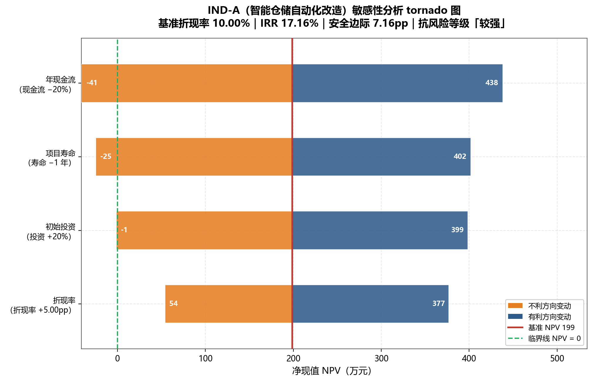

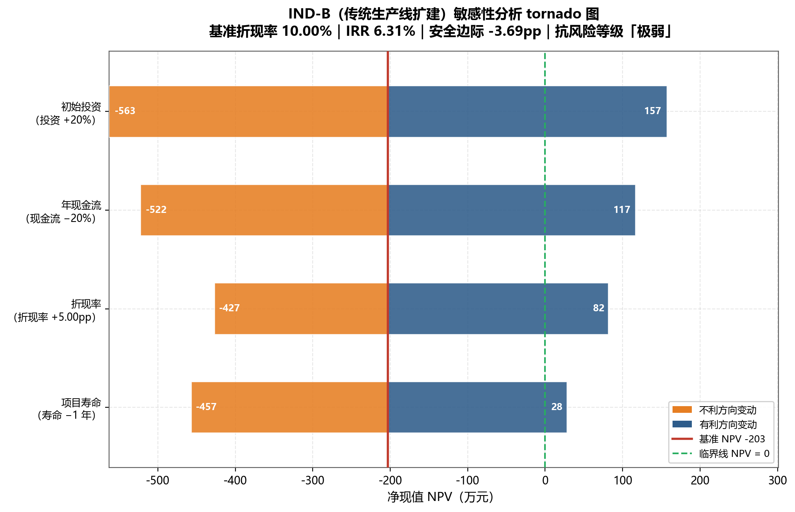

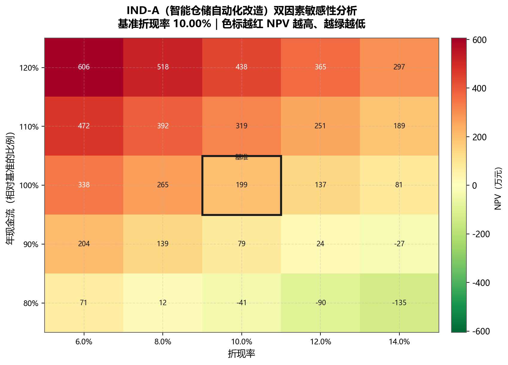

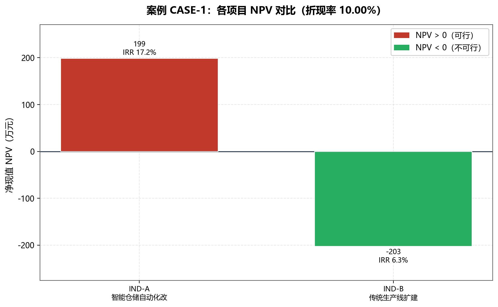

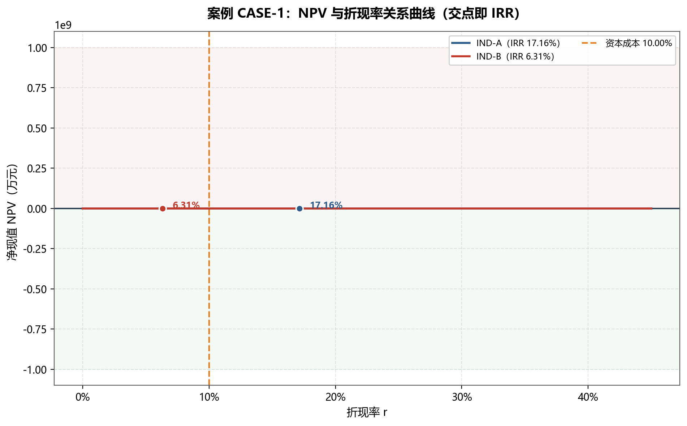

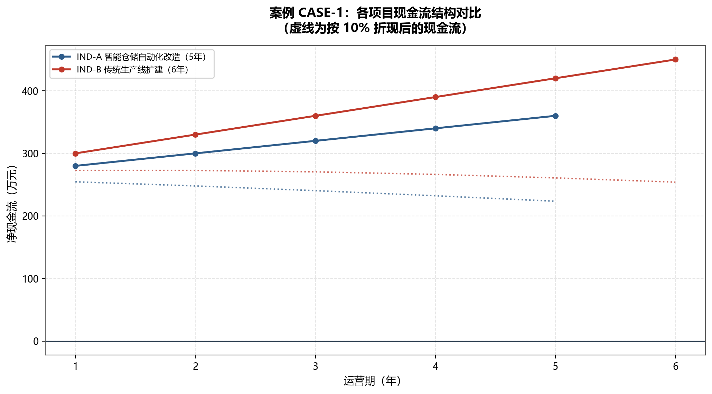


---

## 2. 案例 CASE-2：互斥项目优选（规模冲突组 + 寿命冲突组）

**对应知识点**：NPV 法与 IRR 法的冲突、增量 IRR 分析、年金净流量法处理寿命不等

基准折现率：**10.00%**｜项目数量：**4 个**

### 项目基础数据

| 项目编号 | 项目名称 | 所属行业 | 初始投资(万元) | 寿命(年) | 风险等级 | 互斥组 | 现金流符号变化次数 |
|:---:|:---:|:---:|:---:|:---:|:---:|:---:|:---:|
| MUT-P | 小型技改方案（高报酬率、低净现值） | 智能制造 | 1,000.00 | 3 | 中 | MUT-SCALE | 1 |
| MUT-Q | 大型技改方案（低报酬率、高净现值） | 智能制造 | 2,500.00 | 3 | 中高 | MUT-SCALE | 1 |
| MUT-X | 设备 A 方案（短寿命、高年金） | 设备投资 | 1,000.00 | 6 | 中 | MUT-LIFE | 1 |
| MUT-Y | 设备 B 方案（长寿命、低年金） | 设备投资 | 1,400.00 | 10 | 中 | MUT-LIFE | 1 |

**各期净现金流明细（万元）**

| 项目编号 | 初始投资(万元) | 第1年 | 第2年 | 第3年 | 第4年 | 第5年 | 第6年 | 第7年 | 第8年 | 第9年 | 第10年 |
|:---:|:---:|:---:|:---:|:---:|:---:|:---:|:---:|:---:|:---:|:---:|:---:|
| MUT-P | 1,000.00 | 450.00 | 450.00 | 450.00 | - | - | - | - | - | - | - |
| MUT-Q | 2,500.00 | 1,250.00 | 1,100.00 | 900.00 | - | - | - | - | - | - | - |
| MUT-X | 1,000.00 | 260.00 | 260.00 | 260.00 | 260.00 | 260.00 | 260.00 | - | - | - | - |
| MUT-Y | 1,400.00 | 250.00 | 250.00 | 250.00 | 250.00 | 250.00 | 250.00 | 250.00 | 250.00 | 250.00 | 250.00 |

### 全指标评价结果

| 项目编号 | 项目名称 | 所属行业 | 初始投资(万元) | 寿命期(年) | 折现率 | NPV(万元) | IRR | IRR唯一性 | 年金净流量ANCF(万元) | 盈利能力指数PI | 静态回收期(年) | 动态回收期(年) | MIRR | 可行性 |
|:---:|:---:|:---:|:---:|:---:|:---:|:---:|:---:|:---:|:---:|:---:|:---:|:---:|:---:|:---:|
| MUT-P | 小型技改方案（高报酬率、低净现值） | 智能制造 | 1000.0 | 3 | 10.00% | 119.08 | 16.65% | 唯一 | 47.89 | 1.1191 | 2.22 | 2.65 | 14.20% | 可行 |
| MUT-Q | 大型技改方案（低报酬率、高净现值） | 智能制造 | 2500.0 | 3 | 10.00% | 221.64 | 15.27% | 唯一 | 89.12 | 1.0887 | 2.17 | 2.67 | 13.16% | 可行 |
| MUT-X | 设备 A 方案（短寿命、高年金） | 设备投资 | 1000.0 | 6 | 10.00% | 132.37 | 14.40% | 唯一 | 30.39 | 1.1324 | 3.85 | 5.1 | 12.30% | 可行 |
| MUT-Y | 设备 B 方案（长寿命、低年金） | 设备投资 | 1400.0 | 10 | 10.00% | 136.14 | 12.22% | 唯一 | 22.16 | 1.0972 | 5.6 | 8.63 | 11.03% | 可行 |

### 互斥项目优选

#### 互斥组「MUT-LIFE」

| 方案 | 方案名称 | 投资(万元) | 寿命(年) | NPV(万元) | 年金净流量(万元/年) | IRR |
|:---:|:---:|:---:|:---:|:---:|:---:|:---:|
| MUT-X | 设备 A 方案（短寿命、高年金） | 1,000.00 | 6 | 132.37 | 30.39 | 14.40% |
| MUT-Y | 设备 B 方案（长寿命、低年金） | 1,400.00 | 10 | 136.14 | 22.16 | 12.22% |

**决策建议**：组内方案寿命不同（6年、10年），NPV 不可直接比较，采用 **年金净流量法（等额年金法）** 决策，选择 **MUT-X（设备 A 方案（短寿命、高年金））**，年金净流量 ANCF = 30.39 万元/年，为组内最大值。 ⚠️ 注意：若误用 NPV 法将选中 MUT-Y（NPV 136.14 高于 MUT-X 的 132.37），但该方案寿命更长、年均创造价值反而更低，直接比 NPV 不公平。

#### 互斥组「MUT-SCALE」

| 方案 | 方案名称 | 投资(万元) | 寿命(年) | NPV(万元) | 年金净流量(万元/年) | IRR |
|:---:|:---:|:---:|:---:|:---:|:---:|:---:|
| MUT-P | 小型技改方案（高报酬率、低净现值） | 1,000.00 | 3 | 119.08 | 47.89 | 16.65% |
| MUT-Q | 大型技改方案（低报酬率、高净现值） | 2,500.00 | 3 | 221.64 | 89.12 | 15.27% |

**决策建议**：组内各方案寿命相同（均为 3 年），采用 **净现值法** 决策，选择 **MUT-Q（大型技改方案（低报酬率、高净现值））**，NPV = 221.64 万元，为组内最大值。 ⚠️ 注意：IRR 法会误选 MUT-P（IRR 16.65% 更高，但投资规模小、绝对价值增量低），互斥决策 **必须以 NPV 为准**。增量分析见「增量IRR」字段。

**增量 IRR 分析**

| 小投资方案 | 大投资方案 | 增量投资额(万元) | 增量IRR | 增量IRR唯一性 | 判定 |
|:---:|:---:|:---:|:---:|:---:|:---:|
| MUT-P | MUT-Q | 1500.0 | 14.25% | 唯一 | 增量IRR 14.25% > 资本成本 10.00%，增量投资划算，选 MUT-Q |

### 敏感性分析

#### MUT-P（小型技改方案（高报酬率、低净现值））

基准 NPV **119.08 万元**｜IRR **16.65%**｜安全边际 **+6.65 个百分点**｜抗风险等级「**较强**」

| 影响因素 | 不利变动 | 不利变动后NPV(万元) | 有利变动 | 有利变动后NPV(万元) | NPV波动幅度(万元) | 是否击穿临界点 |
|:---:|:---:|:---:|:---:|:---:|:---:|:---:|
| 项目寿命 | 寿命 −1 年 → 2 年 | -219.01 | 寿命 +1 年 → 4 年 | 426.44 | 645.45 | ⚠️ 是（NPV 转负） |
| 年现金流 | 现金流 −20% | -104.73 | 现金流 +20% | 342.90 | 447.63 | ⚠️ 是（NPV 转负） |
| 初始投资 | 投资 +20% → 1,200 万元 | -80.92 | 投资 −20% → 800 万元 | 319.08 | 400.00 | ⚠️ 是（NPV 转负） |
| 折现率 | 折现率 +5.00pp → 15.00% | 27.45 | 折现率 −5.00pp → 5.00% | 225.46 | 198.01 | 否 |

**临界点分析（NPV = 0 的临界条件）**

| 临界项 | 数值 | 含义 |
|:---:|:---:|:---:|
| 临界折现率（= IRR） |  | 折现率超过该值后项目由可行转为不可行 |
| 初始投资上限 | 可上升 0.00% | 投资超支超过该幅度后 NPV 转负 |
| 年现金流下限 | 可下降 0.00% | 现金流下滑超过该幅度后 NPV 转负 |

#### MUT-Q（大型技改方案（低报酬率、高净现值））

基准 NPV **221.64 万元**｜IRR **15.27%**｜安全边际 **+5.27 个百分点**｜抗风险等级「**较强**」

| 影响因素 | 不利变动 | 不利变动后NPV(万元) | 有利变动 | 有利变动后NPV(万元) | NPV波动幅度(万元) | 是否击穿临界点 |
|:---:|:---:|:---:|:---:|:---:|:---:|:---:|
| 项目寿命 | 寿命 −1 年 → 2 年 | -454.55 | 寿命 +1 年 → 4 年 | 836.35 | 1,290.90 | ⚠️ 是（NPV 转负） |
| 年现金流 | 现金流 −20% | -322.69 | 现金流 +20% | 765.97 | 1,088.66 | ⚠️ 是（NPV 转负） |
| 初始投资 | 投资 +20% → 3,000 万元 | -278.36 | 投资 −20% → 2,000 万元 | 721.64 | 1,000.00 | ⚠️ 是（NPV 转负） |
| 折现率 | 折现率 +5.00pp → 15.00% | 10.48 | 折现率 −5.00pp → 5.00% | 465.66 | 455.18 | 否 |

**临界点分析（NPV = 0 的临界条件）**

| 临界项 | 数值 | 含义 |
|:---:|:---:|:---:|
| 临界折现率（= IRR） |  | 折现率超过该值后项目由可行转为不可行 |
| 初始投资上限 | 可上升 0.00% | 投资超支超过该幅度后 NPV 转负 |
| 年现金流下限 | 可下降 0.00% | 现金流下滑超过该幅度后 NPV 转负 |

#### MUT-X（设备 A 方案（短寿命、高年金））

基准 NPV **132.37 万元**｜IRR **14.40%**｜安全边际 **+4.40 个百分点**｜抗风险等级「**中等**」

| 影响因素 | 不利变动 | 不利变动后NPV(万元) | 有利变动 | 有利变动后NPV(万元) | NPV波动幅度(万元) | 是否击穿临界点 |
|:---:|:---:|:---:|:---:|:---:|:---:|:---:|
| 年现金流 | 现金流 −20% | -94.11 | 现金流 +20% | 358.84 | 452.95 | ⚠️ 是（NPV 转负） |
| 初始投资 | 投资 +20% → 1,200 万元 | -67.63 | 投资 −20% → 800 万元 | 332.37 | 400.00 | ⚠️ 是（NPV 转负） |
| 折现率 | 折现率 +5.00pp → 15.00% | -16.03 | 折现率 −5.00pp → 5.00% | 319.68 | 335.71 | ⚠️ 是（NPV 转负） |
| 项目寿命 | 寿命 −1 年 → 5 年 | -14.40 | 寿命 +1 年 → 7 年 | 265.79 | 280.18 | ⚠️ 是（NPV 转负） |

**临界点分析（NPV = 0 的临界条件）**

| 临界项 | 数值 | 含义 |
|:---:|:---:|:---:|
| 临界折现率（= IRR） |  | 折现率超过该值后项目由可行转为不可行 |
| 初始投资上限 | 可上升 0.00% | 投资超支超过该幅度后 NPV 转负 |
| 年现金流下限 | 可下降 0.00% | 现金流下滑超过该幅度后 NPV 转负 |

#### MUT-Y（设备 B 方案（长寿命、低年金））

基准 NPV **136.14 万元**｜IRR **12.22%**｜安全边际 **+2.22 个百分点**｜抗风险等级「**较弱**」

| 影响因素 | 不利变动 | 不利变动后NPV(万元) | 有利变动 | 有利变动后NPV(万元) | NPV波动幅度(万元) | 是否击穿临界点 |
|:---:|:---:|:---:|:---:|:---:|:---:|:---:|
| 折现率 | 折现率 +5.00pp → 15.00% | -145.31 | 折现率 −5.00pp → 5.00% | 530.43 | 675.74 | ⚠️ 是（NPV 转负） |
| 年现金流 | 现金流 −20% | -171.09 | 现金流 +20% | 443.37 | 614.46 | ⚠️ 是（NPV 转负） |
| 初始投资 | 投资 +20% → 1,680 万元 | -143.86 | 投资 −20% → 1,120 万元 | 416.14 | 560.00 | ⚠️ 是（NPV 转负） |
| 项目寿命 | 寿命 −1 年 → 9 年 | 39.76 | 寿命 +1 年 → 11 年 | 223.77 | 184.01 | 否 |

**临界点分析（NPV = 0 的临界条件）**

| 临界项 | 数值 | 含义 |
|:---:|:---:|:---:|
| 临界折现率（= IRR） |  | 折现率超过该值后项目由可行转为不可行 |
| 初始投资上限 | 可上升 0.00% | 投资超支超过该幅度后 NPV 转负 |
| 年现金流下限 | 可下降 0.00% | 现金流下滑超过该幅度后 NPV 转负 |

**折现率敏感性明细（以首个项目为例）**

| 折现率 | 折现率变动 | NPV(万元) | 相对基准变动(万元) | 可行性 |
|:---:|:---:|:---:|:---:|:---:|
| 6.00% | -4.00% | 202.86 | 83.77 | 可行 |
| 7.00% | -3.00% | 180.94 | 61.86 | 可行 |
| 8.00% | -2.00% | 159.69 | 40.61 | 可行 |
| 9.00% | -1.00% | 139.08 | 20.0 | 可行 |
| 10.00% | 基准 | 119.08 | 0.0 | 可行 |
| 11.00% | +1.00% | 99.67 | -19.41 | 可行 |
| 12.00% | +2.00% | 80.82 | -38.26 | 可行 |
| 13.00% | +3.00% | 62.52 | -56.56 | 可行 |
| 14.00% | +4.00% | 44.73 | -74.35 | 可行 |
| 15.00% | +5.00% | 27.45 | -91.63 | 可行 |

### AI 辅助决策建议

#### MUT-P｜小型技改方案（高报酬率、低净现值）

**结论：可行（推荐投资）**　（风险评分：12/100　文案通道：规则引擎）

> MUT-P（小型技改方案（高报酬率、低净现值））NPV 为 119 万元，IRR 为 16.65%（高于资本成本 10.0%），抗风险能力较强，建议按计划推进。

**决策依据**

- 净现值 NPV = **119.08 万元**（折现率 10.00%，初始投资 1,000 万元，寿命 3 年），大于零，项目创造价值。
- 内含报酬率 IRR = **16.65%**，高于资本成本 10.00%，安全边际 +6.65 个百分点，抗风险等级「较强」。
- 盈利能力指数 PI = **1.1191**，年金净流量 ANCF = **47.89 万元/年**，修正内部收益率 MIRR = 14.20%。
- 静态投资回收期 **2.22 年**（占寿命 74%），动态投资回收期 **2.65 年**。

**风险点提示**

- **折现率风险（可控）**：折现率上升 5 个百分点至 15.00% 时，NPV 仍为 +27.45 万元，距临界折现率（IRR 16.65%）尚有 6.65 个百分点缓冲。
- **投资超支风险（高）**：初始投资最多只能上升 **11.91%**（临界值 1,119 万元），工程超支、建设期延长的容错空间极小。
- **收入下滑风险（中）**：年现金流最大可下降 10.64%，低于此幅度 NPV 转负，需锁定核心客户与长期订单。
- **流动性风险（中）**：静态回收期 2.22 年，占寿命 74%，回收节奏偏慢。

**建议动作**

- **按计划推进**：NPV 与 IRR 双指标通过，安全边际充足。
- **重点监控最敏感因素「项目寿命」**：该因素波动对 NPV 的影响最大（±20% 扰动引起 NPV 变动 645.45 万元），应在项目执行中建立该指标的月度跟踪机制。
- 建议纳入投资组合整体安排，与其他项目在时间与行业上形成分散配置。

#### MUT-Q｜大型技改方案（低报酬率、高净现值）

**结论：可行（推荐投资）**　（风险评分：12/100　文案通道：规则引擎）

> MUT-Q（大型技改方案（低报酬率、高净现值））NPV 为 222 万元，IRR 为 15.27%（高于资本成本 10.0%），抗风险能力较强，建议按计划推进。

**决策依据**

- 净现值 NPV = **221.64 万元**（折现率 10.00%，初始投资 2,500 万元，寿命 3 年），大于零，项目创造价值。
- 内含报酬率 IRR = **15.27%**，高于资本成本 10.00%，安全边际 +5.27 个百分点，抗风险等级「较强」。
- 盈利能力指数 PI = **1.0887**，年金净流量 ANCF = **89.12 万元/年**，修正内部收益率 MIRR = 13.16%。
- 静态投资回收期 **2.17 年**（占寿命 72%），动态投资回收期 **2.67 年**。

**风险点提示**

- **折现率风险（可控）**：折现率上升 5 个百分点至 15.00% 时，NPV 仍为 +10.48 万元，距临界折现率（IRR 15.27%）尚有 5.27 个百分点缓冲。
- **投资超支风险（高）**：初始投资最多只能上升 **8.87%**（临界值 2,722 万元），工程超支、建设期延长的容错空间极小。
- **收入下滑风险（高）**：年现金流最大可下降 **8.14%**，即年均现金流低于 995 万元时 NPV 转为负值。该缓冲幅度低于行业常见的收入波动区间，项目对市场需求变化极为敏感。
- **流动性风险（中）**：静态回收期 2.17 年，占寿命 72%，回收节奏偏慢。

**建议动作**

- **按计划推进**：NPV 与 IRR 双指标通过，安全边际充足。
- **重点监控最敏感因素「项目寿命」**：该因素波动对 NPV 的影响最大（±20% 扰动引起 NPV 变动 1,290.90 万元），应在项目执行中建立该指标的月度跟踪机制。
- 建议纳入投资组合整体安排，与其他项目在时间与行业上形成分散配置。

#### MUT-X｜设备 A 方案（短寿命、高年金）

**结论：可行（推荐投资）**　（风险评分：41/100　文案通道：规则引擎）

> MUT-X（设备 A 方案（短寿命、高年金））NPV 为 132 万元，IRR 为 14.40%（高于资本成本 10.0%），抗风险能力中等，建议按计划推进。

**决策依据**

- 净现值 NPV = **132.37 万元**（折现率 10.00%，初始投资 1,000 万元，寿命 6 年），大于零，项目创造价值。
- 内含报酬率 IRR = **14.40%**，高于资本成本 10.00%，安全边际 +4.40 个百分点，抗风险等级「中等」。
- 盈利能力指数 PI = **1.1324**，年金净流量 ANCF = **30.39 万元/年**，修正内部收益率 MIRR = 12.30%。
- 静态投资回收期 **3.85 年**（占寿命 64%），动态投资回收期 **5.10 年**。

**风险点提示**

- **折现率上升风险（高）**：折现率上升 5 个百分点至 15.00% 时，项目 NPV 由 +132.37 万元转为 -16.03 万元，**由正转负**，抗风险能力较弱（IRR 仅 14.40%，安全边际 4.40pp）。若宏观利率上行或资本成本重估，项目将立即失效。
- **投资超支风险（高）**：初始投资最多只能上升 **13.24%**（临界值 1,132 万元），工程超支、建设期延长的容错空间极小。
- **收入下滑风险（中）**：年现金流最大可下降 11.69%，低于此幅度 NPV 转负，需锁定核心客户与长期订单。

**建议动作**

- **按计划推进**：NPV 与 IRR 双指标通过，安全边际充足。
- **重点监控最敏感因素「年现金流」**：该因素波动对 NPV 的影响最大（±20% 扰动引起 NPV 变动 452.95 万元），应在项目执行中建立该指标的月度跟踪机制。
- 建议纳入投资组合整体安排，与其他项目在时间与行业上形成分散配置。

#### MUT-Y｜设备 B 方案（长寿命、低年金）

**结论：可行但安全边际不足（谨慎推进）**　（风险评分：44/100　文案通道：规则引擎）

> MUT-Y（设备 B 方案（长寿命、低年金））NPV 为 136 万元，但 IRR 12.22% 仅高于资本成本 2.22 个百分点，安全边际偏薄，属于边缘可行项目。

**决策依据**

- 净现值 NPV = **136.14 万元**（折现率 10.00%，初始投资 1,400 万元，寿命 10 年），大于零，项目创造价值。
- 内含报酬率 IRR = **12.22%**，高于资本成本 10.00%，安全边际 +2.22 个百分点，抗风险等级「较弱」。
- 盈利能力指数 PI = **1.0972**，年金净流量 ANCF = **22.16 万元/年**，修正内部收益率 MIRR = 11.03%。
- 静态投资回收期 **5.60 年**（占寿命 56%），动态投资回收期 **8.63 年**。

**风险点提示**

- **折现率上升风险（高）**：折现率上升 5 个百分点至 15.00% 时，项目 NPV 由 +136.14 万元转为 -145.31 万元，**由正转负**，抗风险能力较弱（IRR 仅 12.22%，安全边际 2.22pp）。若宏观利率上行或资本成本重估，项目将立即失效。
- **投资超支风险（高）**：初始投资最多只能上升 **9.72%**（临界值 1,536 万元），工程超支、建设期延长的容错空间极小。
- **收入下滑风险（高）**：年现金流最大可下降 **8.86%**，即年均现金流低于 228 万元时 NPV 转为负值。该缓冲幅度低于行业常见的收入波动区间，项目对市场需求变化极为敏感。

**建议动作**

- **分期投入、设置退出机制**：将投资拆分为 2~3 期，每期结束后按实测现金流复核是否继续。
- **锁定收益端不确定性**：签订长期供货/服务合同，压低现金流波动。
- 设置折现率红线：资本成本一旦超过 12.22%，立即停止后续投入。

### 案例图表

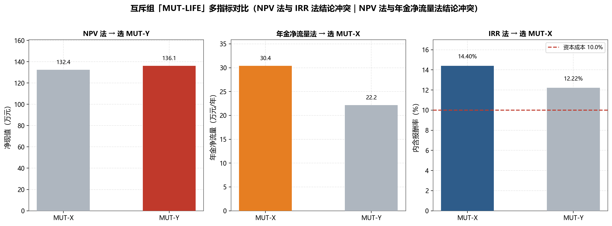

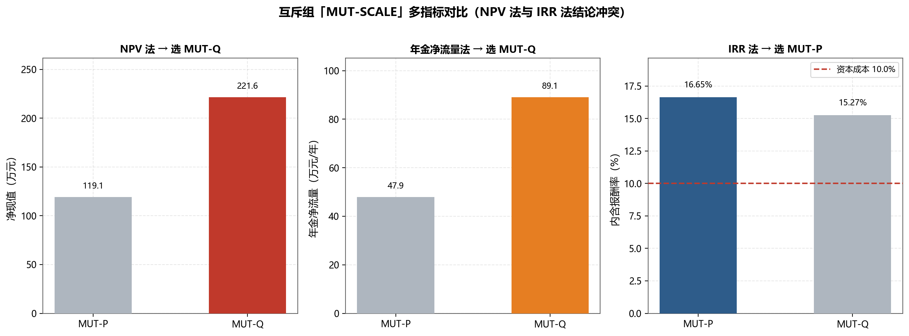

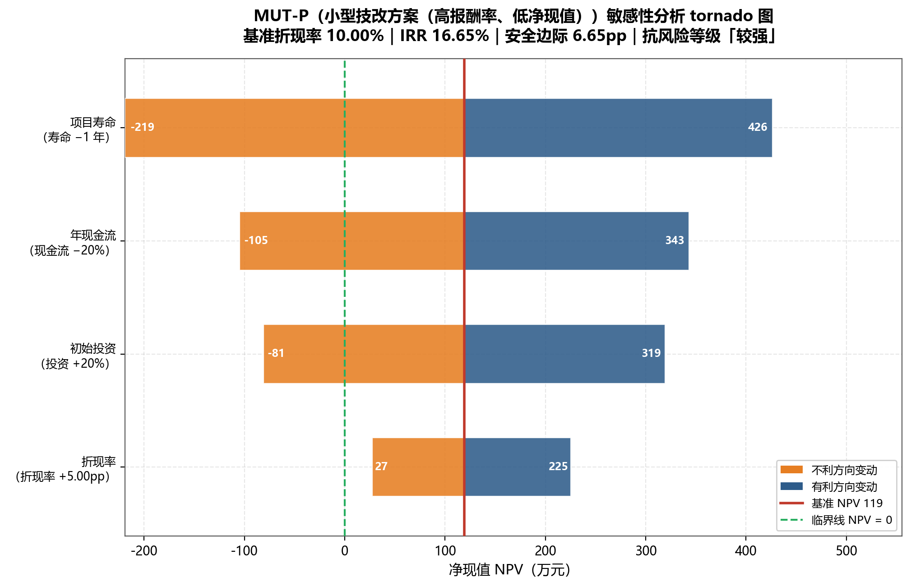

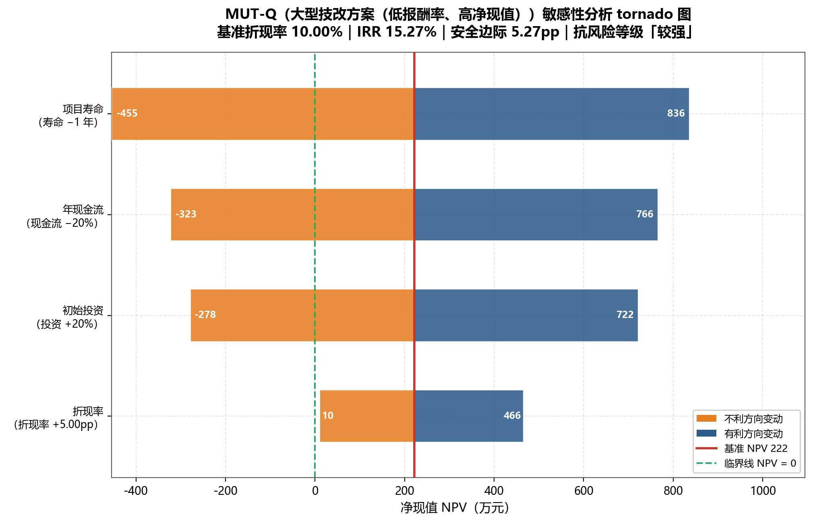

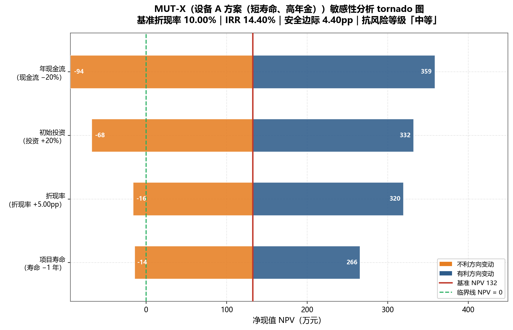

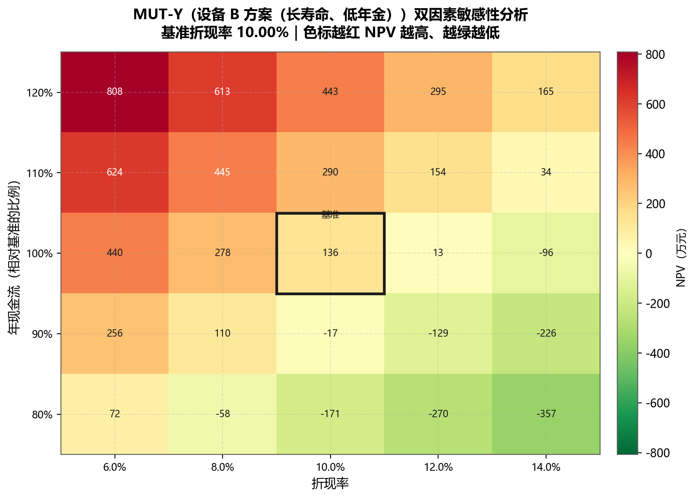

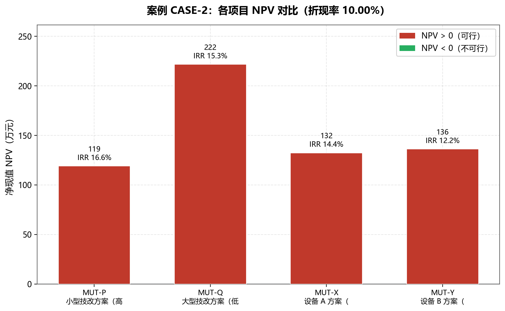

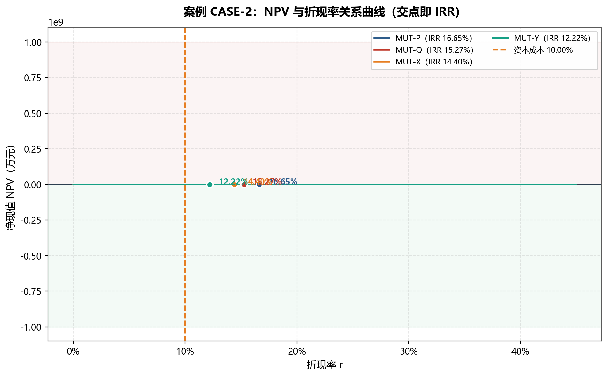

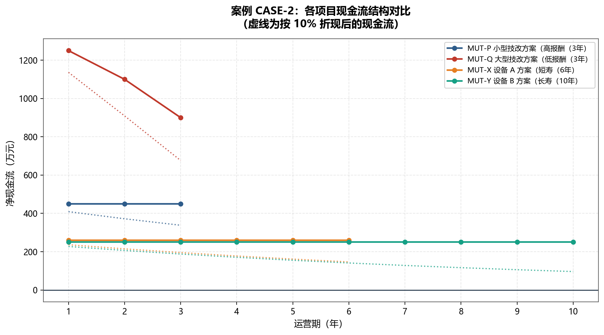


---

## 3. 案例 CASE-3：资本限额下的项目组合优化（限额 3000 万元）

**对应知识点**：排序法（PI 贪心）因额度碎片化失效，需用组合穷举法求全局最优

基准折现率：**10.00%**｜资本限额：**3,000 万元**｜项目数量：**8 个**

### 项目基础数据

| 项目编号 | 项目名称 | 所属行业 | 初始投资(万元) | 寿命(年) | 风险等级 | 互斥组 | 现金流符号变化次数 |
|:---:|:---:|:---:|:---:|:---:|:---:|:---:|:---:|
| CAP-A | 智能制造产线升级 | 智能制造 | 1,800.00 | 6 | 中 | - | 1 |
| CAP-B | 区域仓储中心建设 | 物流仓储 | 1,500.00 | 8 | 中 | - | 1 |
| CAP-C | 冷链物流基地 | 物流仓储 | 1,500.00 | 9 | 中高 | - | 1 |
| CAP-D | 数据中台建设 | 信息技术 | 1,000.00 | 5 | 中 | - | 1 |
| CAP-E | 生产设备更新 | 设备投资 | 1,000.00 | 6 | 中 | - | 1 |
| CAP-F | 新能源充电站网络 | 新能源 | 1,200.00 | 7 | 中高 | - | 1 |
| CAP-G | 节能改造成套设备 | 节能环保 | 800.00 | 4 | 中 | - | 1 |
| CAP-H | 办公信息化系统 | 信息技术 | 600.00 | 3 | 低 | - | 1 |

**各期净现金流明细（万元）**

| 项目编号 | 初始投资(万元) | 第1年 | 第2年 | 第3年 | 第4年 | 第5年 | 第6年 | 第7年 | 第8年 | 第9年 |
|:---:|:---:|:---:|:---:|:---:|:---:|:---:|:---:|:---:|:---:|:---:|
| CAP-A | 1,800.00 | 619.94 | 619.94 | 619.94 | 619.94 | 619.94 | 619.94 | - | - | - |
| CAP-B | 1,500.00 | 418.94 | 418.94 | 418.94 | 418.94 | 418.94 | 418.94 | 418.94 | 418.94 | - |
| CAP-C | 1,500.00 | 386.35 | 386.35 | 386.35 | 386.35 | 386.35 | 386.35 | 386.35 | 386.35 | 386.35 |
| CAP-D | 1,000.00 | 387.79 | 387.79 | 387.79 | 387.79 | 387.79 | - | - | - | - |
| CAP-E | 1,000.00 | 335.23 | 335.23 | 335.23 | 335.23 | 335.23 | 335.23 | - | - | - |
| CAP-F | 1,200.00 | 357.41 | 357.41 | 357.41 | 357.41 | 357.41 | 357.41 | 357.41 | - | - |
| CAP-G | 800.00 | 360.89 | 360.89 | 360.89 | 360.89 | - | - | - | - | - |
| CAP-H | 600.00 | 340.18 | 340.18 | 340.18 | - | - | - | - | - | - |

### 全指标评价结果

| 项目编号 | 项目名称 | 所属行业 | 初始投资(万元) | 寿命期(年) | 折现率 | NPV(万元) | IRR | IRR唯一性 | 年金净流量ANCF(万元) | 盈利能力指数PI | 静态回收期(年) | 动态回收期(年) | MIRR | 可行性 |
|:---:|:---:|:---:|:---:|:---:|:---:|:---:|:---:|:---:|:---:|:---:|:---:|:---:|:---:|:---:|
| CAP-A | 智能制造产线升级 | 智能制造 | 1800.0 | 6 | 10.00% | 900.0 | 25.72% | 唯一 | 206.65 | 1.5 | 2.9 | 3.61 | 17.69% | 可行 |
| CAP-B | 区域仓储中心建设 | 物流仓储 | 1500.0 | 8 | 10.00% | 735.01 | 22.38% | 唯一 | 137.77 | 1.49 | 3.58 | 4.66 | 15.62% | 可行 |
| CAP-C | 冷链物流基地 | 物流仓储 | 1500.0 | 9 | 10.00% | 725.0 | 21.19% | 唯一 | 125.89 | 1.4833 | 3.88 | 5.16 | 14.93% | 可行 |
| CAP-D | 数据中台建设 | 信息技术 | 1000.0 | 5 | 10.00% | 470.03 | 27.08% | 唯一 | 123.99 | 1.47 | 2.58 | 3.13 | 18.81% | 可行 |
| CAP-E | 生产设备更新 | 设备投资 | 1000.0 | 6 | 10.00% | 460.01 | 24.54% | 唯一 | 105.62 | 1.46 | 2.98 | 3.73 | 17.16% | 可行 |
| CAP-F | 新能源充电站网络 | 新能源 | 1200.0 | 7 | 10.00% | 540.02 | 22.65% | 唯一 | 110.92 | 1.45 | 3.36 | 4.3 | 16.00% | 可行 |
| CAP-G | 节能改造成套设备 | 节能环保 | 800.0 | 4 | 10.00% | 343.97 | 28.64% | 唯一 | 108.51 | 1.43 | 2.22 | 2.64 | 20.29% | 可行 |
| CAP-H | 办公信息化系统 | 信息技术 | 600.0 | 3 | 10.00% | 245.98 | 32.10% | 唯一 | 98.91 | 1.41 | 1.76 | 2.04 | 23.35% | 可行 |

### 资本限额下的项目组合优化

| 求解方法 | 入选项目 | 入选数量 | 合计投资(万元) | 组合NPV(万元) | 额度使用率 | 闲置额度(万元) |
|:---:|:---:|:---:|:---:|:---:|:---:|:---:|
| 排序法（PI 贪心） | CAP-A + CAP-D | 2 | 2800.0 | 1370.03 | 93.33% | 200.0 |
| 组合法（DFS 穷举 + 剪枝） | CAP-B + CAP-C | 2 | 3000.0 | 1460.01 | 100.00% | 0.0 |
| 背包法（0-1 DP，单位 1 万元） | CAP-B + CAP-C | 2 | 3000.0 | 1460.01 | 100.00% | 0.0 |

**最优组合**：CAP-B + CAP-C（合计投资 3,000.00 万元，组合 NPV 1,460.01 万元，额度使用率 100.00%）

**方法对比分析**

**排序法未能取得最优解。** 排序法组合 [CAP-A + CAP-D] 的 NPV 合计为 1,370.03 万元，剩余闲置额度 200.00 万元（使用率仅 93.33%）；组合法给出的最优组合 [CAP-B + CAP-C] 的 NPV 合计为 1,460.01 万元，额度使用率 100.00%，较排序法多创造价值 **89.98 万元（提升 6.57%）**。

**原因分析**：排序法按盈利能力指数 PI 降序装入，优先选中了 PI 最高的 CAP-A（投资 1,800 万元）等方案，挤占了额度并产生 200.00 万元碎片化闲置额度，使后续项目无法装入；而组合法通过穷举全部可行组合，找到了额度利用率更高、整体 NPV 更大的组合。结论：**资本额度不可分割时，排序法（PI 贪心）不保证最优，应使用组合法。**

**交叉验证**：背包法（0-1 动态规划）得到组合 [CAP-B + CAP-C]，NPV 合计 1,460.01 万元，与组合法结果完全一致，验证了穷举求解的正确性。

### 敏感性分析

#### CAP-A（智能制造产线升级）

基准 NPV **900.00 万元**｜IRR **25.72%**｜安全边际 **+15.72 个百分点**｜抗风险等级「**强**」

| 影响因素 | 不利变动 | 不利变动后NPV(万元) | 有利变动 | 有利变动后NPV(万元) | NPV波动幅度(万元) | 是否击穿临界点 |
|:---:|:---:|:---:|:---:|:---:|:---:|:---:|
| 年现金流 | 现金流 −20% | 360.00 | 现金流 +20% | 1,440.00 | 1,080.00 | 否 |
| 折现率 | 折现率 +5.00pp → 15.00% | 546.15 | 折现率 −5.00pp → 5.00% | 1,346.62 | 800.47 | 否 |
| 初始投资 | 投资 +20% → 2,160 万元 | 540.00 | 投资 −20% → 1,440 万元 | 1,260.00 | 720.00 | 否 |
| 项目寿命 | 寿命 −1 年 → 5 年 | 550.06 | 寿命 +1 年 → 7 年 | 1,218.13 | 668.07 | 否 |

**临界点分析（NPV = 0 的临界条件）**

| 临界项 | 数值 | 含义 |
|:---:|:---:|:---:|
| 临界折现率（= IRR） |  | 折现率超过该值后项目由可行转为不可行 |
| 初始投资上限 | 可上升 0.00% | 投资超支超过该幅度后 NPV 转负 |
| 年现金流下限 | 可下降 0.00% | 现金流下滑超过该幅度后 NPV 转负 |

#### CAP-B（区域仓储中心建设）

基准 NPV **735.01 万元**｜IRR **22.38%**｜安全边际 **+12.38 个百分点**｜抗风险等级「**强**」

| 影响因素 | 不利变动 | 不利变动后NPV(万元) | 有利变动 | 有利变动后NPV(万元) | NPV波动幅度(万元) | 是否击穿临界点 |
|:---:|:---:|:---:|:---:|:---:|:---:|:---:|
| 年现金流 | 现金流 −20% | 288.01 | 现金流 +20% | 1,182.02 | 894.01 | 否 |
| 折现率 | 折现率 +5.00pp → 15.00% | 379.92 | 折现率 −5.00pp → 5.00% | 1,207.70 | 827.78 | 否 |
| 初始投资 | 投资 +20% → 1,800 万元 | 435.01 | 投资 −20% → 1,200 万元 | 1,035.01 | 600.00 | 否 |
| 项目寿命 | 寿命 −1 年 → 7 年 | 539.58 | 寿命 +1 年 → 9 年 | 912.69 | 373.11 | 否 |

**临界点分析（NPV = 0 的临界条件）**

| 临界项 | 数值 | 含义 |
|:---:|:---:|:---:|
| 临界折现率（= IRR） |  | 折现率超过该值后项目由可行转为不可行 |
| 初始投资上限 | 可上升 0.00% | 投资超支超过该幅度后 NPV 转负 |
| 年现金流下限 | 可下降 0.00% | 现金流下滑超过该幅度后 NPV 转负 |

#### CAP-C（冷链物流基地）

基准 NPV **725.00 万元**｜IRR **21.19%**｜安全边际 **+11.19 个百分点**｜抗风险等级「**强**」

| 影响因素 | 不利变动 | 不利变动后NPV(万元) | 有利变动 | 有利变动后NPV(万元) | NPV波动幅度(万元) | 是否击穿临界点 |
|:---:|:---:|:---:|:---:|:---:|:---:|:---:|
| 折现率 | 折现率 +5.00pp → 15.00% | 343.50 | 折现率 −5.00pp → 5.00% | 1,246.11 | 902.61 | 否 |
| 年现金流 | 现金流 −20% | 280.00 | 现金流 +20% | 1,170.00 | 890.00 | 否 |
| 初始投资 | 投资 +20% → 1,800 万元 | 425.00 | 投资 −20% → 1,200 万元 | 1,025.00 | 600.00 | 否 |
| 项目寿命 | 寿命 −1 年 → 8 年 | 561.15 | 寿命 +1 年 → 10 年 | 873.95 | 312.80 | 否 |

**临界点分析（NPV = 0 的临界条件）**

| 临界项 | 数值 | 含义 |
|:---:|:---:|:---:|
| 临界折现率（= IRR） |  | 折现率超过该值后项目由可行转为不可行 |
| 初始投资上限 | 可上升 0.00% | 投资超支超过该幅度后 NPV 转负 |
| 年现金流下限 | 可下降 0.00% | 现金流下滑超过该幅度后 NPV 转负 |

#### CAP-D（数据中台建设）

基准 NPV **470.03 万元**｜IRR **27.08%**｜安全边际 **+17.08 个百分点**｜抗风险等级「**强**」

| 影响因素 | 不利变动 | 不利变动后NPV(万元) | 有利变动 | 有利变动后NPV(万元) | NPV波动幅度(万元) | 是否击穿临界点 |
|:---:|:---:|:---:|:---:|:---:|:---:|:---:|
| 年现金流 | 现金流 −20% | 176.02 | 现金流 +20% | 764.04 | 588.01 | 否 |
| 项目寿命 | 寿命 −1 年 → 4 年 | 229.24 | 寿命 +1 年 → 6 年 | 688.93 | 459.68 | 否 |
| 初始投资 | 投资 +20% → 1,200 万元 | 270.03 | 投资 −20% → 800 万元 | 670.03 | 400.00 | 否 |
| 折现率 | 折现率 +5.00pp → 15.00% | 299.93 | 折现率 −5.00pp → 5.00% | 678.93 | 379.00 | 否 |

**临界点分析（NPV = 0 的临界条件）**

| 临界项 | 数值 | 含义 |
|:---:|:---:|:---:|
| 临界折现率（= IRR） |  | 折现率超过该值后项目由可行转为不可行 |
| 初始投资上限 | 可上升 0.00% | 投资超支超过该幅度后 NPV 转负 |
| 年现金流下限 | 可下降 0.00% | 现金流下滑超过该幅度后 NPV 转负 |

#### CAP-E（生产设备更新）

基准 NPV **460.01 万元**｜IRR **24.54%**｜安全边际 **+14.54 个百分点**｜抗风险等级「**强**」

| 影响因素 | 不利变动 | 不利变动后NPV(万元) | 有利变动 | 有利变动后NPV(万元) | NPV波动幅度(万元) | 是否击穿临界点 |
|:---:|:---:|:---:|:---:|:---:|:---:|:---:|
| 年现金流 | 现金流 −20% | 168.01 | 现金流 +20% | 752.02 | 584.01 | 否 |
| 折现率 | 折现率 +5.00pp → 15.00% | 268.67 | 折现率 −5.00pp → 5.00% | 701.52 | 432.85 | 否 |
| 初始投资 | 投资 +20% → 1,200 万元 | 260.01 | 投资 −20% → 800 万元 | 660.01 | 400.00 | 否 |
| 项目寿命 | 寿命 −1 年 → 5 年 | 270.79 | 寿命 +1 年 → 7 年 | 632.04 | 361.25 | 否 |

**临界点分析（NPV = 0 的临界条件）**

| 临界项 | 数值 | 含义 |
|:---:|:---:|:---:|
| 临界折现率（= IRR） |  | 折现率超过该值后项目由可行转为不可行 |
| 初始投资上限 | 可上升 0.00% | 投资超支超过该幅度后 NPV 转负 |
| 年现金流下限 | 可下降 0.00% | 现金流下滑超过该幅度后 NPV 转负 |

#### CAP-F（新能源充电站网络）

基准 NPV **540.02 万元**｜IRR **22.65%**｜安全边际 **+12.65 个百分点**｜抗风险等级「**强**」

| 影响因素 | 不利变动 | 不利变动后NPV(万元) | 有利变动 | 有利变动后NPV(万元) | NPV波动幅度(万元) | 是否击穿临界点 |
|:---:|:---:|:---:|:---:|:---:|:---:|:---:|
| 年现金流 | 现金流 −20% | 192.02 | 现金流 +20% | 888.03 | 696.01 | 否 |
| 折现率 | 折现率 +5.00pp → 15.00% | 286.98 | 折现率 −5.00pp → 5.00% | 868.11 | 581.13 | 否 |
| 初始投资 | 投资 +20% → 1,440 万元 | 300.02 | 投资 −20% → 960 万元 | 780.02 | 480.00 | 否 |
| 项目寿命 | 寿命 −1 年 → 6 年 | 356.61 | 寿命 +1 年 → 8 年 | 706.76 | 350.14 | 否 |

**临界点分析（NPV = 0 的临界条件）**

| 临界项 | 数值 | 含义 |
|:---:|:---:|:---:|
| 临界折现率（= IRR） |  | 折现率超过该值后项目由可行转为不可行 |
| 初始投资上限 | 可上升 0.00% | 投资超支超过该幅度后 NPV 转负 |
| 年现金流下限 | 可下降 0.00% | 现金流下滑超过该幅度后 NPV 转负 |

#### CAP-G（节能改造成套设备）

基准 NPV **343.97 万元**｜IRR **28.64%**｜安全边际 **+18.64 个百分点**｜抗风险等级「**强**」

| 影响因素 | 不利变动 | 不利变动后NPV(万元) | 有利变动 | 有利变动后NPV(万元) | NPV波动幅度(万元) | 是否击穿临界点 |
|:---:|:---:|:---:|:---:|:---:|:---:|:---:|
| 项目寿命 | 寿命 −1 年 → 3 年 | 97.48 | 寿命 +1 年 → 5 年 | 568.06 | 470.58 | 否 |
| 年现金流 | 现金流 −20% | 115.18 | 现金流 +20% | 572.77 | 457.59 | 否 |
| 初始投资 | 投资 +20% → 960 万元 | 183.97 | 投资 −20% → 640 万元 | 503.97 | 320.00 | 否 |
| 折现率 | 折现率 +5.00pp → 15.00% | 230.33 | 折现率 −5.00pp → 5.00% | 479.70 | 249.36 | 否 |

**临界点分析（NPV = 0 的临界条件）**

| 临界项 | 数值 | 含义 |
|:---:|:---:|:---:|
| 临界折现率（= IRR） |  | 折现率超过该值后项目由可行转为不可行 |
| 初始投资上限 | 可上升 0.00% | 投资超支超过该幅度后 NPV 转负 |
| 年现金流下限 | 可下降 0.00% | 现金流下滑超过该幅度后 NPV 转负 |

#### CAP-H（办公信息化系统）

基准 NPV **245.98 万元**｜IRR **32.10%**｜安全边际 **+22.10 个百分点**｜抗风险等级「**强**」

| 影响因素 | 不利变动 | 不利变动后NPV(万元) | 有利变动 | 有利变动后NPV(万元) | NPV波动幅度(万元) | 是否击穿临界点 |
|:---:|:---:|:---:|:---:|:---:|:---:|:---:|
| 项目寿命 | 寿命 −1 年 → 2 年 | -9.60 | 寿命 +1 年 → 4 年 | 478.32 | 487.93 | ⚠️ 是（NPV 转负） |
| 年现金流 | 现金流 −20% | 76.78 | 现金流 +20% | 415.17 | 338.39 | 否 |
| 初始投资 | 投资 +20% → 720 万元 | 125.98 | 投资 −20% → 480 万元 | 365.98 | 240.00 | 否 |
| 折现率 | 折现率 +5.00pp → 15.00% | 176.71 | 折现率 −5.00pp → 5.00% | 326.39 | 149.69 | 否 |

**临界点分析（NPV = 0 的临界条件）**

| 临界项 | 数值 | 含义 |
|:---:|:---:|:---:|
| 临界折现率（= IRR） |  | 折现率超过该值后项目由可行转为不可行 |
| 初始投资上限 | 可上升 0.00% | 投资超支超过该幅度后 NPV 转负 |
| 年现金流下限 | 可下降 0.00% | 现金流下滑超过该幅度后 NPV 转负 |

**折现率敏感性明细（以首个项目为例）**

| 折现率 | 折现率变动 | NPV(万元) | 相对基准变动(万元) | 可行性 |
|:---:|:---:|:---:|:---:|:---:|
| 6.00% | -4.00% | 1248.45 | 348.45 | 可行 |
| 7.00% | -3.00% | 1154.97 | 254.97 | 可行 |
| 8.00% | -2.00% | 1065.91 | 165.91 | 可行 |
| 9.00% | -1.00% | 981.0 | 81.0 | 可行 |
| 10.00% | 基准 | 900.0 | 0.0 | 可行 |
| 11.00% | +1.00% | 822.68 | -77.32 | 可行 |
| 12.00% | +2.00% | 748.83 | -151.17 | 可行 |
| 13.00% | +3.00% | 678.24 | -221.76 | 可行 |
| 14.00% | +4.00% | 610.74 | -289.26 | 可行 |
| 15.00% | +5.00% | 546.15 | -353.85 | 可行 |

### AI 辅助决策建议

#### CAP-A｜智能制造产线升级

**结论：可行（推荐投资）**　（风险评分：8/100　文案通道：规则引擎）

> CAP-A（智能制造产线升级）NPV 为 900 万元，IRR 为 25.72%（高于资本成本 10.0%），抗风险能力强，建议按计划推进。

**决策依据**

- 净现值 NPV = **900.00 万元**（折现率 10.00%，初始投资 1,800 万元，寿命 6 年），大于零，项目创造价值。
- 内含报酬率 IRR = **25.72%**，高于资本成本 10.00%，安全边际 +15.72 个百分点，抗风险等级「强」。
- 盈利能力指数 PI = **1.5000**，年金净流量 ANCF = **206.65 万元/年**，修正内部收益率 MIRR = 17.69%。
- 静态投资回收期 **2.90 年**（占寿命 48%），动态投资回收期 **3.61 年**。

**风险点提示**

- **折现率风险（可控）**：折现率上升 5 个百分点至 15.00% 时，NPV 仍为 +546.15 万元，距临界折现率（IRR 25.72%）尚有 15.72 个百分点缓冲。
- **投资超支风险（低）**：初始投资可承受最大超支 50.00%，预算弹性充足。
- **收入下滑风险（低）**：年现金流可承受 33.33% 的降幅，对市场波动的缓冲较厚。
- **资本集中度风险（中高）**：本项目占资本限额的 60%，若单独投产将显著抬高整体资金集中度，建议与其他项目组合实施以分散风险。

**建议动作**

- **按计划推进**：NPV 与 IRR 双指标通过，安全边际充足。
- **重点监控最敏感因素「年现金流」**：该因素波动对 NPV 的影响最大（±20% 扰动引起 NPV 变动 1,080.00 万元），应在项目执行中建立该指标的月度跟踪机制。
- 建议纳入投资组合整体安排，与其他项目在时间与行业上形成分散配置。

#### CAP-B｜区域仓储中心建设

**结论：可行（推荐投资）**　（风险评分：8/100　文案通道：规则引擎）

> CAP-B（区域仓储中心建设）NPV 为 735 万元，IRR 为 22.38%（高于资本成本 10.0%），抗风险能力强，建议按计划推进。

**决策依据**

- 净现值 NPV = **735.01 万元**（折现率 10.00%，初始投资 1,500 万元，寿命 8 年），大于零，项目创造价值。
- 内含报酬率 IRR = **22.38%**，高于资本成本 10.00%，安全边际 +12.38 个百分点，抗风险等级「强」。
- 盈利能力指数 PI = **1.4900**，年金净流量 ANCF = **137.77 万元/年**，修正内部收益率 MIRR = 15.62%。
- 静态投资回收期 **3.58 年**（占寿命 45%），动态投资回收期 **4.66 年**。

**风险点提示**

- **折现率风险（可控）**：折现率上升 5 个百分点至 15.00% 时，NPV 仍为 +379.92 万元，距临界折现率（IRR 22.38%）尚有 12.38 个百分点缓冲。
- **投资超支风险（低）**：初始投资可承受最大超支 49.00%，预算弹性充足。
- **收入下滑风险（低）**：年现金流可承受 32.89% 的降幅，对市场波动的缓冲较厚。
- **资本集中度风险（中高）**：本项目占资本限额的 50%，若单独投产将显著抬高整体资金集中度，建议与其他项目组合实施以分散风险。

**建议动作**

- **按计划推进**：NPV 与 IRR 双指标通过，安全边际充足。
- **重点监控最敏感因素「年现金流」**：该因素波动对 NPV 的影响最大（±20% 扰动引起 NPV 变动 894.01 万元），应在项目执行中建立该指标的月度跟踪机制。
- 建议纳入投资组合整体安排，与其他项目在时间与行业上形成分散配置。

#### CAP-C｜冷链物流基地

**结论：可行（推荐投资）**　（风险评分：8/100　文案通道：规则引擎）

> CAP-C（冷链物流基地）NPV 为 725 万元，IRR 为 21.19%（高于资本成本 10.0%），抗风险能力强，建议按计划推进。

**决策依据**

- 净现值 NPV = **725.00 万元**（折现率 10.00%，初始投资 1,500 万元，寿命 9 年），大于零，项目创造价值。
- 内含报酬率 IRR = **21.19%**，高于资本成本 10.00%，安全边际 +11.19 个百分点，抗风险等级「强」。
- 盈利能力指数 PI = **1.4833**，年金净流量 ANCF = **125.89 万元/年**，修正内部收益率 MIRR = 14.93%。
- 静态投资回收期 **3.88 年**（占寿命 43%），动态投资回收期 **5.16 年**。

**风险点提示**

- **折现率风险（可控）**：折现率上升 5 个百分点至 15.00% 时，NPV 仍为 +343.50 万元，距临界折现率（IRR 21.19%）尚有 11.19 个百分点缓冲。
- **投资超支风险（低）**：初始投资可承受最大超支 48.33%，预算弹性充足。
- **收入下滑风险（低）**：年现金流可承受 32.58% 的降幅，对市场波动的缓冲较厚。
- **资本集中度风险（中高）**：本项目占资本限额的 50%，若单独投产将显著抬高整体资金集中度，建议与其他项目组合实施以分散风险。

**建议动作**

- **按计划推进**：NPV 与 IRR 双指标通过，安全边际充足。
- **重点监控最敏感因素「折现率」**：该因素波动对 NPV 的影响最大（±20% 扰动引起 NPV 变动 902.61 万元），应在项目执行中建立该指标的月度跟踪机制。
- 建议纳入投资组合整体安排，与其他项目在时间与行业上形成分散配置。

#### CAP-D｜数据中台建设

**结论：可行（推荐投资）**　（风险评分：0/100　文案通道：规则引擎）

> CAP-D（数据中台建设）NPV 为 470 万元，IRR 为 27.08%（高于资本成本 10.0%），抗风险能力强，建议按计划推进。

**决策依据**

- 净现值 NPV = **470.03 万元**（折现率 10.00%，初始投资 1,000 万元，寿命 5 年），大于零，项目创造价值。
- 内含报酬率 IRR = **27.08%**，高于资本成本 10.00%，安全边际 +17.08 个百分点，抗风险等级「强」。
- 盈利能力指数 PI = **1.4700**，年金净流量 ANCF = **123.99 万元/年**，修正内部收益率 MIRR = 18.81%。
- 静态投资回收期 **2.58 年**（占寿命 52%），动态投资回收期 **3.13 年**。

**风险点提示**

- **折现率风险（可控）**：折现率上升 5 个百分点至 15.00% 时，NPV 仍为 +299.93 万元，距临界折现率（IRR 27.08%）尚有 17.08 个百分点缓冲。
- **投资超支风险（低）**：初始投资可承受最大超支 47.00%，预算弹性充足。
- **收入下滑风险（低）**：年现金流可承受 31.97% 的降幅，对市场波动的缓冲较厚。

**建议动作**

- **按计划推进**：NPV 与 IRR 双指标通过，安全边际充足。
- **重点监控最敏感因素「年现金流」**：该因素波动对 NPV 的影响最大（±20% 扰动引起 NPV 变动 588.01 万元），应在项目执行中建立该指标的月度跟踪机制。
- 建议纳入投资组合整体安排，与其他项目在时间与行业上形成分散配置。

#### CAP-E｜生产设备更新

**结论：可行（推荐投资）**　（风险评分：0/100　文案通道：规则引擎）

> CAP-E（生产设备更新）NPV 为 460 万元，IRR 为 24.54%（高于资本成本 10.0%），抗风险能力强，建议按计划推进。

**决策依据**

- 净现值 NPV = **460.01 万元**（折现率 10.00%，初始投资 1,000 万元，寿命 6 年），大于零，项目创造价值。
- 内含报酬率 IRR = **24.54%**，高于资本成本 10.00%，安全边际 +14.54 个百分点，抗风险等级「强」。
- 盈利能力指数 PI = **1.4600**，年金净流量 ANCF = **105.62 万元/年**，修正内部收益率 MIRR = 17.16%。
- 静态投资回收期 **2.98 年**（占寿命 50%），动态投资回收期 **3.73 年**。

**风险点提示**

- **折现率风险（可控）**：折现率上升 5 个百分点至 15.00% 时，NPV 仍为 +268.67 万元，距临界折现率（IRR 24.54%）尚有 14.54 个百分点缓冲。
- **投资超支风险（低）**：初始投资可承受最大超支 46.00%，预算弹性充足。
- **收入下滑风险（低）**：年现金流可承受 31.51% 的降幅，对市场波动的缓冲较厚。

**建议动作**

- **按计划推进**：NPV 与 IRR 双指标通过，安全边际充足。
- **重点监控最敏感因素「年现金流」**：该因素波动对 NPV 的影响最大（±20% 扰动引起 NPV 变动 584.01 万元），应在项目执行中建立该指标的月度跟踪机制。
- 建议纳入投资组合整体安排，与其他项目在时间与行业上形成分散配置。

#### CAP-F｜新能源充电站网络

**结论：可行（推荐投资）**　（风险评分：8/100　文案通道：规则引擎）

> CAP-F（新能源充电站网络）NPV 为 540 万元，IRR 为 22.65%（高于资本成本 10.0%），抗风险能力强，建议按计划推进。

**决策依据**

- 净现值 NPV = **540.02 万元**（折现率 10.00%，初始投资 1,200 万元，寿命 7 年），大于零，项目创造价值。
- 内含报酬率 IRR = **22.65%**，高于资本成本 10.00%，安全边际 +12.65 个百分点，抗风险等级「强」。
- 盈利能力指数 PI = **1.4500**，年金净流量 ANCF = **110.92 万元/年**，修正内部收益率 MIRR = 16.00%。
- 静态投资回收期 **3.36 年**（占寿命 48%），动态投资回收期 **4.30 年**。

**风险点提示**

- **折现率风险（可控）**：折现率上升 5 个百分点至 15.00% 时，NPV 仍为 +286.98 万元，距临界折现率（IRR 22.65%）尚有 12.65 个百分点缓冲。
- **投资超支风险（低）**：初始投资可承受最大超支 45.00%，预算弹性充足。
- **收入下滑风险（低）**：年现金流可承受 31.04% 的降幅，对市场波动的缓冲较厚。
- **资本集中度风险（中高）**：本项目占资本限额的 40%，若单独投产将显著抬高整体资金集中度，建议与其他项目组合实施以分散风险。

**建议动作**

- **按计划推进**：NPV 与 IRR 双指标通过，安全边际充足。
- **重点监控最敏感因素「年现金流」**：该因素波动对 NPV 的影响最大（±20% 扰动引起 NPV 变动 696.01 万元），应在项目执行中建立该指标的月度跟踪机制。
- 建议纳入投资组合整体安排，与其他项目在时间与行业上形成分散配置。

#### CAP-G｜节能改造成套设备

**结论：可行（推荐投资）**　（风险评分：0/100　文案通道：规则引擎）

> CAP-G（节能改造成套设备）NPV 为 344 万元，IRR 为 28.64%（高于资本成本 10.0%），抗风险能力强，建议按计划推进。

**决策依据**

- 净现值 NPV = **343.97 万元**（折现率 10.00%，初始投资 800 万元，寿命 4 年），大于零，项目创造价值。
- 内含报酬率 IRR = **28.64%**，高于资本成本 10.00%，安全边际 +18.64 个百分点，抗风险等级「强」。
- 盈利能力指数 PI = **1.4300**，年金净流量 ANCF = **108.51 万元/年**，修正内部收益率 MIRR = 20.29%。
- 静态投资回收期 **2.22 年**（占寿命 55%），动态投资回收期 **2.64 年**。

**风险点提示**

- **折现率风险（可控）**：折现率上升 5 个百分点至 15.00% 时，NPV 仍为 +230.33 万元，距临界折现率（IRR 28.64%）尚有 18.64 个百分点缓冲。
- **投资超支风险（低）**：初始投资可承受最大超支 43.00%，预算弹性充足。
- **收入下滑风险（低）**：年现金流可承受 30.07% 的降幅，对市场波动的缓冲较厚。

**建议动作**

- **按计划推进**：NPV 与 IRR 双指标通过，安全边际充足。
- **重点监控最敏感因素「项目寿命」**：该因素波动对 NPV 的影响最大（±20% 扰动引起 NPV 变动 470.58 万元），应在项目执行中建立该指标的月度跟踪机制。
- 建议纳入投资组合整体安排，与其他项目在时间与行业上形成分散配置。

#### CAP-H｜办公信息化系统

**结论：可行（推荐投资）**　（风险评分：0/100　文案通道：规则引擎）

> CAP-H（办公信息化系统）NPV 为 246 万元，IRR 为 32.10%（高于资本成本 10.0%），抗风险能力强，建议按计划推进。

**决策依据**

- 净现值 NPV = **245.98 万元**（折现率 10.00%，初始投资 600 万元，寿命 3 年），大于零，项目创造价值。
- 内含报酬率 IRR = **32.10%**，高于资本成本 10.00%，安全边际 +22.10 个百分点，抗风险等级「强」。
- 盈利能力指数 PI = **1.4100**，年金净流量 ANCF = **98.91 万元/年**，修正内部收益率 MIRR = 23.35%。
- 静态投资回收期 **1.76 年**（占寿命 59%），动态投资回收期 **2.04 年**。

**风险点提示**

- **折现率风险（可控）**：折现率上升 5 个百分点至 15.00% 时，NPV 仍为 +176.71 万元，距临界折现率（IRR 32.10%）尚有 22.10 个百分点缓冲。
- **投资超支风险（低）**：初始投资可承受最大超支 41.00%，预算弹性充足。
- **收入下滑风险（低）**：年现金流可承受 29.08% 的降幅，对市场波动的缓冲较厚。

**建议动作**

- **按计划推进**：NPV 与 IRR 双指标通过，安全边际充足。
- **重点监控最敏感因素「项目寿命」**：该因素波动对 NPV 的影响最大（±20% 扰动引起 NPV 变动 487.93 万元），应在项目执行中建立该指标的月度跟踪机制。
- 建议纳入投资组合整体安排，与其他项目在时间与行业上形成分散配置。

### 案例图表

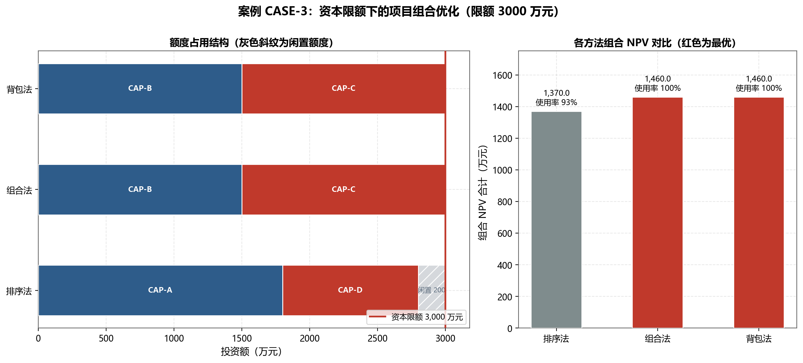

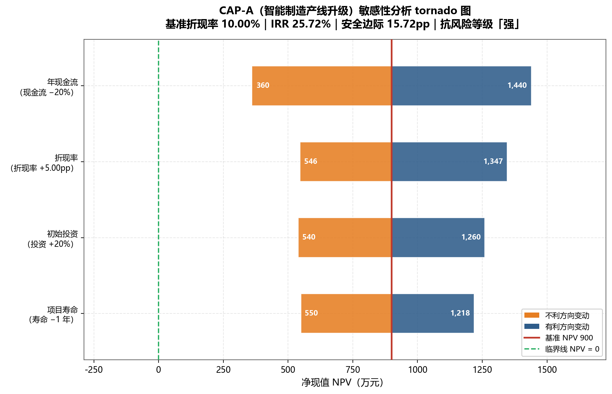

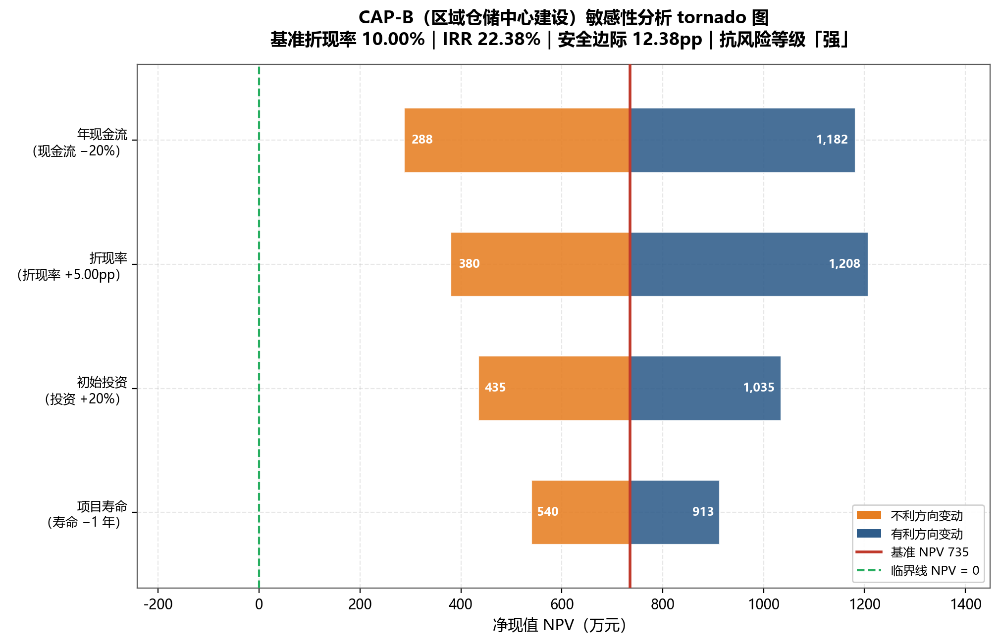

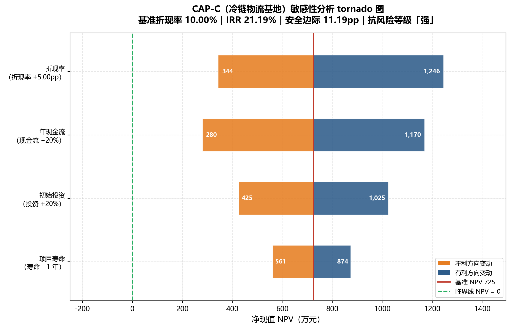

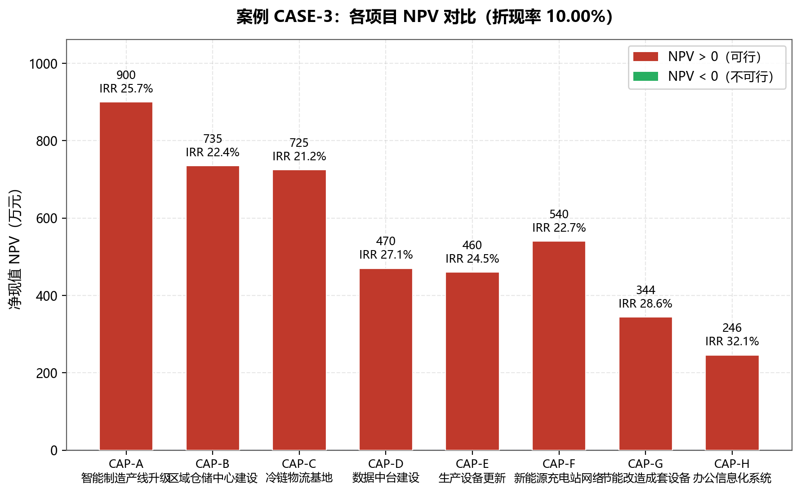

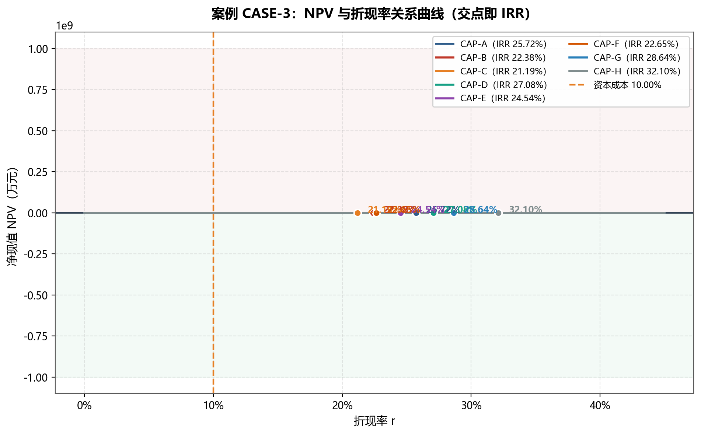


---

## 4. 案例 CASE-4：非常规现金流与多重 IRR 检验

**对应知识点**：现金流多次变号导致 IRR 多解；NPV 与折现率非单调（折现率升高 NPV 反而上升）；多重 IRR 项目须以 NPV 为唯一判据并辅以 MIRR

基准折现率：**10.00%**｜项目数量：**3 个**

### 项目基础数据

| 项目编号 | 项目名称 | 所属行业 | 初始投资(万元) | 寿命(年) | 风险等级 | 互斥组 | 现金流符号变化次数 |
|:---:|:---:|:---:|:---:|:---:|:---:|:---:|:---:|
| UNC-A | 矿山开发项目（含生态治理支出） | 采掘业 | 2,000.00 | 2 | 高 | - | 2 |
| UNC-B | 化工装置退役治理项目 | 化工环保 | 2,000.00 | 2 | 高 | - | 2 |
| UNC-C | 常规现金流对照项目 | 设备投资 | 1,500.00 | 3 | 中 | - | 1 |

**各期净现金流明细（万元）**

| 项目编号 | 初始投资(万元) | 第1年 | 第2年 | 第3年 |
|:---:|:---:|:---:|:---:|:---:|
| UNC-A | 2,000.00 | 5,400.00 | -3,520.00 | - |
| UNC-B | 2,000.00 | 4,600.00 | -2,625.00 | - |
| UNC-C | 1,500.00 | 600.00 | 600.00 | 600.00 |

### 全指标评价结果

| 项目编号 | 项目名称 | 所属行业 | 初始投资(万元) | 寿命期(年) | 折现率 | NPV(万元) | IRR | IRR唯一性 | 年金净流量ANCF(万元) | 盈利能力指数PI | 静态回收期(年) | 动态回收期(年) | MIRR | 可行性 |
|:---:|:---:|:---:|:---:|:---:|:---:|:---:|:---:|:---:|:---:|:---:|:---:|:---:|:---:|:---:|
| UNC-A | 矿山开发项目（含生态治理支出） | 采掘业 | 2000.0 | 2 | 10.00% | 0.0 | 10.00% | 多重(2个) | 0.0 | 1.0 | 0.37 | 0.41 | 10.00% | 不可行 |
| UNC-B | 化工装置退役治理项目 | 化工环保 | 2000.0 | 2 | 10.00% | 12.4 | 5.00% | 多重(2个) | 7.14 | 1.0062 | 0.43 | 0.48 | 10.16% | 可行 |
| UNC-C | 常规现金流对照项目 | 设备投资 | 1500.0 | 3 | 10.00% | -7.89 | 9.70% | 唯一 | -3.17 | 0.9947 | 2.5 | 寿命内未收回 | 9.81% | 不可行 |

### 敏感性分析

#### UNC-A（矿山开发项目（含生态治理支出））

基准 NPV **0.00 万元**｜IRR **10.00%**｜安全边际 **+0.00 个百分点**｜抗风险等级「**极弱**」

| 影响因素 | 不利变动 | 不利变动后NPV(万元) | 有利变动 | 有利变动后NPV(万元) | NPV波动幅度(万元) | 是否击穿临界点 |
|:---:|:---:|:---:|:---:|:---:|:---:|:---:|
| 项目寿命 | 寿命 −1 年 → 1 年 | 2,909.09 | 寿命 +1 年 → 3 年 | -2,644.63 | 5,553.72 | 否 |
| 年现金流 | 现金流 −20% | -400.00 | 现金流 +20% | 400.00 | 800.00 | 否 |
| 初始投资 | 投资 +20% → 2,400 万元 | -400.00 | 投资 −20% → 1,600 万元 | 400.00 | 800.00 | 否 |
| 折现率 | 折现率 +5.00pp → 15.00% | 34.03 | 折现率 −5.00pp → 5.00% | -49.89 | 83.91 | 否 |

**临界点分析（NPV = 0 的临界条件）**

| 临界项 | 数值 | 含义 |
|:---:|:---:|:---:|
| 临界折现率（= IRR） |  | 折现率超过该值后项目由可行转为不可行 |
| 初始投资上限 | 可上升 0.00% | 投资超支超过该幅度后 NPV 转负 |
| 年现金流下限 | 可下降 0.00% | 现金流下滑超过该幅度后 NPV 转负 |

#### UNC-B（化工装置退役治理项目）

基准 NPV **12.40 万元**｜IRR **5.00%**｜安全边际 **-5.00 个百分点**｜抗风险等级「**极弱**」

| 影响因素 | 不利变动 | 不利变动后NPV(万元) | 有利变动 | 有利变动后NPV(万元) | NPV波动幅度(万元) | 是否击穿临界点 |
|:---:|:---:|:---:|:---:|:---:|:---:|:---:|
| 项目寿命 | 寿命 −1 年 → 1 年 | 2,181.82 | 寿命 +1 年 → 3 年 | -1,959.80 | 4,141.62 | 否 |
| 年现金流 | 现金流 −20% | -390.08 | 现金流 +20% | 414.88 | 804.96 | ⚠️ 是（NPV 转负） |
| 初始投资 | 投资 +20% → 2,400 万元 | -387.60 | 投资 −20% → 1,600 万元 | 412.40 | 800.00 | ⚠️ 是（NPV 转负） |
| 折现率 | 折现率 +5.00pp → 15.00% | 15.12 | 折现率 −5.00pp → 5.00% | 0.00 | 15.12 | 否 |

**临界点分析（NPV = 0 的临界条件）**

| 临界项 | 数值 | 含义 |
|:---:|:---:|:---:|
| 临界折现率（= IRR） |  | 折现率超过该值后项目由可行转为不可行 |
| 初始投资上限 | 可上升 0.00% | 投资超支超过该幅度后 NPV 转负 |
| 年现金流下限 | 可下降 0.00% | 现金流下滑超过该幅度后 NPV 转负 |

#### UNC-C（常规现金流对照项目）

基准 NPV **-7.89 万元**｜IRR **9.70%**｜安全边际 **-0.30 个百分点**｜抗风险等级「**极弱**」

| 影响因素 | 不利变动 | 不利变动后NPV(万元) | 有利变动 | 有利变动后NPV(万元) | NPV波动幅度(万元) | 是否击穿临界点 |
|:---:|:---:|:---:|:---:|:---:|:---:|:---:|
| 项目寿命 | 寿命 −1 年 → 2 年 | -458.68 | 寿命 +1 年 → 4 年 | 401.92 | 860.60 | 否 |
| 初始投资 | 投资 +20% → 1,800 万元 | -307.89 | 投资 −20% → 1,200 万元 | 292.11 | 600.00 | 否 |
| 年现金流 | 现金流 −20% | -306.31 | 现金流 +20% | 290.53 | 596.84 | 否 |
| 折现率 | 折现率 +5.00pp → 15.00% | -130.06 | 折现率 −5.00pp → 5.00% | 133.95 | 264.01 | 否 |

**临界点分析（NPV = 0 的临界条件）**

| 临界项 | 数值 | 含义 |
|:---:|:---:|:---:|
| 临界折现率（= IRR） |  | 折现率超过该值后项目由可行转为不可行 |
| 初始投资上限 | 可上升 0.00% | 投资超支超过该幅度后 NPV 转负 |
| 年现金流下限 | 可下降 0.00% | 现金流下滑超过该幅度后 NPV 转负 |

**折现率敏感性明细（以首个项目为例）**

| 折现率 | 折现率变动 | NPV(万元) | 相对基准变动(万元) | 可行性 |
|:---:|:---:|:---:|:---:|:---:|
| 6.00% | -4.00% | -38.45 | -38.45 | 不可行 |
| 7.00% | -3.00% | -27.78 | -27.78 | 不可行 |
| 8.00% | -2.00% | -17.83 | -17.83 | 不可行 |
| 9.00% | -1.00% | -8.59 | -8.59 | 不可行 |
| 10.00% | 基准 | 0.0 | 0.0 | 不可行 |
| 11.00% | +1.00% | 7.95 | 7.95 | 可行 |
| 12.00% | +2.00% | 15.31 | 15.31 | 可行 |
| 13.00% | +3.00% | 22.08 | 22.08 | 可行 |
| 14.00% | +4.00% | 28.32 | 28.32 | 可行 |
| 15.00% | +5.00% | 34.03 | 34.03 | 可行 |

### AI 辅助决策建议

#### UNC-A｜矿山开发项目（含生态治理支出）

**结论：IRR 多重根失效 → 按 NPV 判定：不可行**　（风险评分：57/100　文案通道：规则引擎）

> UNC-A（矿山开发项目（含生态治理支出））在 10.0% 折现率下 NPV 为 0 万元（恰好为零，处于可行性临界点），按 NPV 判定不可行；该项目 IRR 存在 2 个实根（10.00%、60.00%），IRR 判据失效，不可作为决策或考核依据。

**决策依据**

- 净现值 NPV = **0.00 万元**（折现率 10.00%，初始投资 2,000 万元，寿命 2 年），恰好为零，**项目处于可行性临界点**——既不创造也不减损价值。
- 内含报酬率 IRR 方程 **存在 2 个实根（10.00%、60.00%）**，IRR 判据失效，可行性改以 NPV 为唯一依据（MIRR = 10.00%，恒唯一，可作稳定替代判据）。
- 盈利能力指数 PI = **1.0000**，年金净流量 ANCF = **0.00 万元/年**，修正内部收益率 MIRR = 10.00%。
- 静态投资回收期 **0.37 年**（占寿命 19%），动态投资回收期 **0.41 年**。

**风险点提示**

- **折现率非单调风险（高）**：本项目 NPV 与折现率 **非单调**——折现率从 10.00% 升至 15.00% 时，NPV 由 0.00 万元变为 34.03 万元（反而上升），与常规项目「折现率越高、NPV 越低」的规律相反。因此不能凭折现率的变动方向推断项目的风险方向，必须逐点绘制 NPV—折现率曲线后再作判断。
- **投资超支风险（高）**：项目当前 NPV **已处于可行性临界状态**，初始投资 **没有任何超支空间**（临界投资额 2,000 万元与当前投资额基本持平），任何超支都会使 NPV 立即转为负值。
- **收入下滑风险（高）**：项目当前 NPV **已处于可行性临界状态**，年现金流 **没有任何下降空间**（临界年均现金流约 940 万元，与当前年均 940 万元基本持平），任何收入下滑都会使 NPV 立即转为负值。
- **指标失效风险（高）**：现金流出现 2 次符号变化，IRR 方程存在 **2 个实根**（10.00%、60.00%），IRR 指标不适用。当资本成本落在两个实根之间时 NPV 为正、之外则为负，同一项目会因折现率取值不同得出相反结论。此时应以 NPV 为唯一判据，或改用 MIRR（10.00%）。
- **经营波动风险（中高）**：各期现金流变异系数 4.74（474%），现金流分布离散度高，收入预测的不确定性较大。

**建议动作**

- **以 NPV 为唯一决策依据**：本项目在基准折现率下 NPV 不为正，按 NPV 判定不可行；IRR 因多重根不具参考价值。
- 向决策层披露多重 IRR 情形，避免使用 IRR 作为对外的项目绩效承诺指标。
- 关注 NPV—折现率曲线的 **非单调性**：应结合完整曲线而非单点取值判断项目，并同时列示 MIRR 作为辅助判据。

#### UNC-B｜化工装置退役治理项目

**结论：IRR 多重根失效 → 按 NPV 判定：可行**　（风险评分：57/100　文案通道：规则引擎）

> UNC-B（化工装置退役治理项目）在 10.0% 折现率下 NPV 为 +12 万元，按 NPV 判定 **可行**；但该项目 IRR 存在 2 个实根（5.00%、25.00%），IRR 判据完全失效，决策须以 NPV 与 MIRR 为唯一依据。

**决策依据**

- 净现值 NPV = **12.40 万元**（折现率 10.00%，初始投资 2,000 万元，寿命 2 年），大于零，项目创造价值。
- 内含报酬率 IRR 方程 **存在 2 个实根（5.00%、25.00%）**，IRR 判据失效，可行性改以 NPV 为唯一依据（MIRR = 10.16%，恒唯一，可作稳定替代判据）。
- 盈利能力指数 PI = **1.0062**，年金净流量 ANCF = **7.14 万元/年**，修正内部收益率 MIRR = 10.16%。
- 静态投资回收期 **0.43 年**（占寿命 22%），动态投资回收期 **0.48 年**。

**风险点提示**

- **折现率非单调风险（高）**：本项目 NPV 与折现率 **非单调**——折现率从 10.00% 升至 15.00% 时，NPV 由 12.40 万元变为 15.12 万元（反而上升），与常规项目「折现率越高、NPV 越低」的规律相反。因此不能凭折现率的变动方向推断项目的风险方向，必须逐点绘制 NPV—折现率曲线后再作判断。
- **投资超支风险（高）**：初始投资最多只能上升 **0.62%**（临界值 2,012 万元），工程超支、建设期延长的容错空间极小。
- **收入下滑风险（高）**：年现金流最大可下降 **0.62%**，即年均现金流低于 981 万元时 NPV 转为负值。该缓冲幅度低于行业常见的收入波动区间，项目对市场需求变化极为敏感。
- **指标失效风险（高）**：现金流出现 2 次符号变化，IRR 方程存在 **2 个实根**（5.00%、25.00%），IRR 指标不适用。当资本成本落在两个实根之间时 NPV 为正、之外则为负，同一项目会因折现率取值不同得出相反结论。此时应以 NPV 为唯一判据，或改用 MIRR（10.16%）。
- **经营波动风险（中高）**：各期现金流变异系数 3.66（366%），现金流分布离散度高，收入预测的不确定性较大。

**建议动作**

- **以 NPV 为唯一决策依据**：本项目在基准折现率下 NPV 为正，按 NPV 判定可行；IRR 因多重根不具参考价值，不得用于决策与绩效考核。
- 向决策层披露多重 IRR 情形，避免使用 IRR 作为对外的项目绩效承诺指标。
- 关注 NPV—折现率曲线的 **非单调性**：应结合完整曲线而非单点取值判断项目，并同时列示 MIRR 作为辅助判据。

#### UNC-C｜常规现金流对照项目

**结论：不可行（建议否决）**　（风险评分：45/100　文案通道：规则引擎）

> UNC-C（常规现金流对照项目）在 10.0% 折现率下 NPV 为 -8 万元，未能覆盖资本成本，建议否决或重新设计方案参数。

**决策依据**

- 净现值 NPV = **-7.89 万元**（折现率 10.00%，初始投资 1,500 万元，寿命 3 年），小于零，项目减损价值。
- 内含报酬率 IRR = **9.70%**，低于资本成本 10.00%，安全边际 -0.30 个百分点，抗风险等级「极弱」。
- 盈利能力指数 PI = **0.9947**，年金净流量 ANCF = **-3.17 万元/年**，修正内部收益率 MIRR = 9.81%。
- 静态投资回收期 **2.50 年**（占寿命 83%）；但 **动态投资回收期超过项目寿命**，说明扣减资金时间价值后，项目在整个寿命期内无法收回全部投资。

**风险点提示**

- **可行性风险（高）**：项目在基准折现率 10.00% 下 NPV 已为 -7.89 万元，本身即不满足可行性要求；折现率再上升 5 个百分点至 15.00% 时 NPV 降至 -130.06 万元，亏损进一步扩大。**当前首要矛盾是项目自身的盈利性而非折现率波动**，应在压缩投资或提升现金流后再评估折现率风险。
- **投资规模风险（高）**：初始投资已 **超出临界投资额** —— 临界值为 1,492 万元，而当前投资为 1,500 万元，超出 8 万元（0.53%）。项目当前即为负 NPV，必须先将投资规模压缩至临界值以下，再重新测算。
- **收入水平风险（高）**：年现金流已 **低于临界水平** —— 临界年均现金流为 603 万元，而当前年均仅 600 万元，缺口 3 万元（0.53%）。项目当前即为负 NPV，需将收入水平提升至临界值以上或压缩投资规模后重新测算。
- **流动性风险（中）**：静态回收期 2.50 年，占寿命 83%，回收节奏偏慢。

**建议动作**

- **否决该方案**：当前参数下无法覆盖资本成本，不建议投入资金。
- 若战略上必须推进，需重新设计：压缩初始投资（当前 1,500 万元，需降至 1,492 万元以内）、延长寿命期或提升产能利用率以抬升年现金流。

### 案例图表

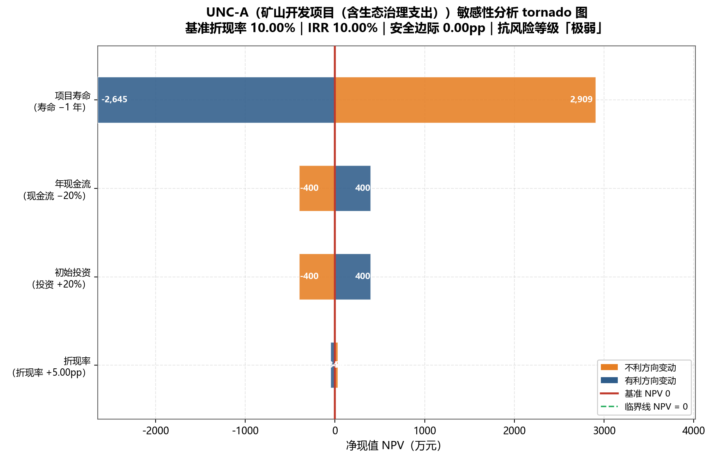

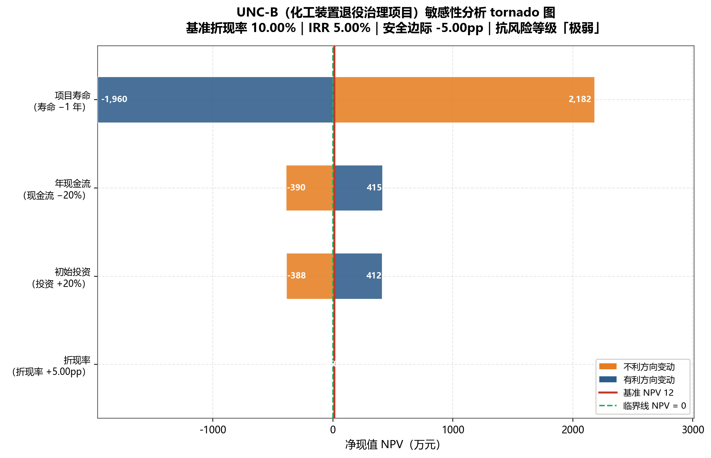

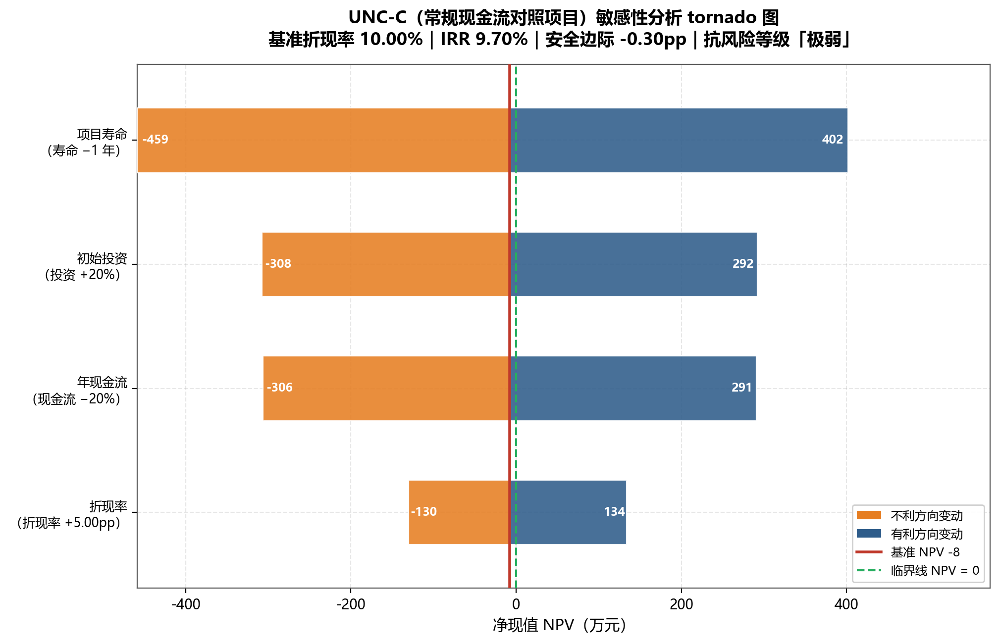

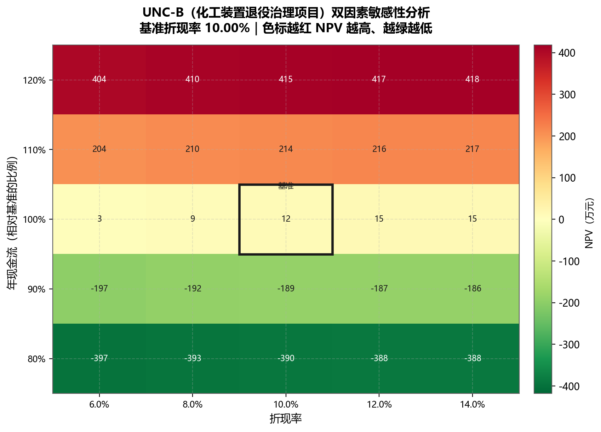

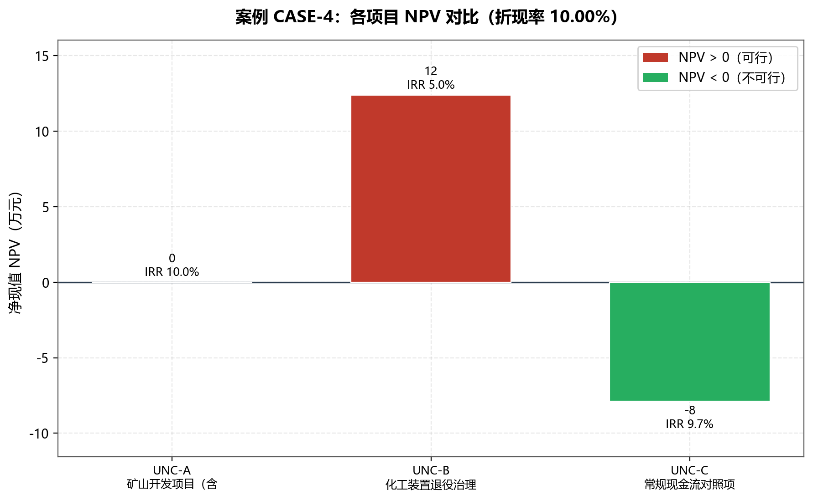

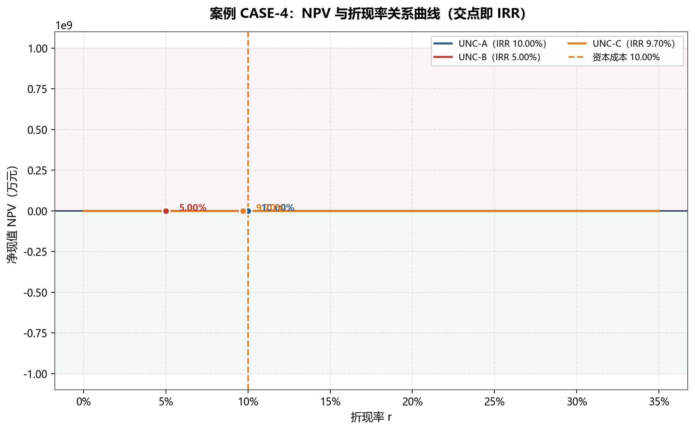

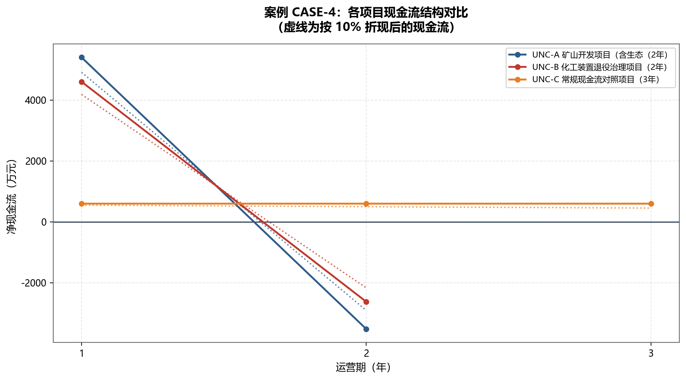


---

## 5. 案例 CASE-5：投资决策敏感性分析（抗风险强 / 弱对照）

**对应知识点**：安全边际（IRR - 折现率）决定抗风险能力；识别边缘可行项目

基准折现率：**10.00%**｜项目数量：**2 个**

### 项目基础数据

| 项目编号 | 项目名称 | 所属行业 | 初始投资(万元) | 寿命(年) | 风险等级 | 互斥组 | 现金流符号变化次数 |
|:---:|:---:|:---:|:---:|:---:|:---:|:---:|:---:|
| SENS-S | 智能装备产线（抗风险较强） | 智能制造 | 5,000.00 | 8 | 中 | - | 1 |
| SENS-W | 传统产线改造（抗风险较弱） | 传统制造 | 5,000.00 | 8 | 中高 | - | 1 |

**各期净现金流明细（万元）**

| 项目编号 | 初始投资(万元) | 第1年 | 第2年 | 第3年 | 第4年 | 第5年 | 第6年 | 第7年 | 第8年 |
|:---:|:---:|:---:|:---:|:---:|:---:|:---:|:---:|:---:|:---:|
| SENS-S | 5,000.00 | 1,000.00 | 1,050.00 | 1,100.00 | 1,150.00 | 1,200.00 | 1,250.00 | 1,300.00 | 1,550.00 |
| SENS-W | 5,000.00 | 800.00 | 850.00 | 900.00 | 950.00 | 1,000.00 | 1,050.00 | 1,100.00 | 1,300.00 |

### 全指标评价结果

| 项目编号 | 项目名称 | 所属行业 | 初始投资(万元) | 寿命期(年) | 折现率 | NPV(万元) | IRR | IRR唯一性 | 年金净流量ANCF(万元) | 盈利能力指数PI | 静态回收期(年) | 动态回收期(年) | MIRR | 可行性 |
|:---:|:---:|:---:|:---:|:---:|:---:|:---:|:---:|:---:|:---:|:---:|:---:|:---:|:---:|:---:|
| SENS-S | 智能装备产线（抗风险较强） | 智能制造 | 5000.0 | 8 | 10.00% | 1229.66 | 16.00% | 唯一 | 230.49 | 1.2459 | 4.58 | 6.24 | 13.07% | 可行 |
| SENS-W | 传统产线改造（抗风险较弱） | 传统制造 | 5000.0 | 8 | 10.00% | 139.35 | 10.70% | 唯一 | 26.12 | 1.0279 | 5.48 | 7.77 | 10.38% | 可行 |

### 敏感性分析

#### SENS-S（智能装备产线（抗风险较强））

基准 NPV **1,229.66 万元**｜IRR **16.00%**｜安全边际 **+6.00 个百分点**｜抗风险等级「**较强**」

| 影响因素 | 不利变动 | 不利变动后NPV(万元) | 有利变动 | 有利变动后NPV(万元) | NPV波动幅度(万元) | 是否击穿临界点 |
|:---:|:---:|:---:|:---:|:---:|:---:|:---:|
| 年现金流 | 现金流 −20% | -16.27 | 现金流 +20% | 2,475.59 | 2,491.86 | ⚠️ 是（NPV 转负） |
| 折现率 | 折现率 +5.00pp → 15.00% | 176.74 | 折现率 −5.00pp → 5.00% | 2,647.08 | 2,470.34 | 否 |
| 初始投资 | 投资 +20% → 6,000 万元 | 229.66 | 投资 −20% → 4,000 万元 | 2,229.66 | 2,000.00 | 否 |
| 项目寿命 | 寿命 −1 年 → 7 年 | 506.57 | 寿命 +1 年 → 9 年 | 1,887.01 | 1,380.44 | 否 |

**临界点分析（NPV = 0 的临界条件）**

| 临界项 | 数值 | 含义 |
|:---:|:---:|:---:|
| 临界折现率（= IRR） |  | 折现率超过该值后项目由可行转为不可行 |
| 初始投资上限 | 可上升 0.00% | 投资超支超过该幅度后 NPV 转负 |
| 年现金流下限 | 可下降 0.00% | 现金流下滑超过该幅度后 NPV 转负 |

#### SENS-W（传统产线改造（抗风险较弱））

基准 NPV **139.35 万元**｜IRR **10.70%**｜安全边际 **+0.70 个百分点**｜抗风险等级「**极弱**」

| 影响因素 | 不利变动 | 不利变动后NPV(万元) | 有利变动 | 有利变动后NPV(万元) | NPV波动幅度(万元) | 是否击穿临界点 |
|:---:|:---:|:---:|:---:|:---:|:---:|:---:|
| 折现率 | 折现率 +5.00pp → 15.00% | -737.07 | 折现率 −5.00pp → 5.00% | 1,320.59 | 2,057.67 | ⚠️ 是（NPV 转负） |
| 年现金流 | 现金流 −20% | -888.52 | 现金流 +20% | 1,167.22 | 2,055.74 | ⚠️ 是（NPV 转负） |
| 初始投资 | 投资 +20% → 6,000 万元 | -860.65 | 投资 −20% → 4,000 万元 | 1,139.35 | 2,000.00 | ⚠️ 是（NPV 转负） |
| 项目寿命 | 寿命 −1 年 → 7 年 | -467.11 | 寿命 +1 年 → 9 年 | 690.68 | 1,157.79 | ⚠️ 是（NPV 转负） |

**临界点分析（NPV = 0 的临界条件）**

| 临界项 | 数值 | 含义 |
|:---:|:---:|:---:|
| 临界折现率（= IRR） |  | 折现率超过该值后项目由可行转为不可行 |
| 初始投资上限 | 可上升 0.00% | 投资超支超过该幅度后 NPV 转负 |
| 年现金流下限 | 可下降 0.00% | 现金流下滑超过该幅度后 NPV 转负 |

**折现率敏感性明细（以首个项目为例）**

| 折现率 | 折现率变动 | NPV(万元) | 相对基准变动(万元) | 可行性 |
|:---:|:---:|:---:|:---:|:---:|
| 6.00% | -4.00% | 2327.36 | 1097.69 | 可行 |
| 7.00% | -3.00% | 2027.15 | 797.49 | 可行 |
| 8.00% | -2.00% | 1745.0 | 515.34 | 可行 |
| 9.00% | -1.00% | 1479.58 | 249.91 | 可行 |
| 10.00% | 基准 | 1229.66 | 0.0 | 可行 |
| 11.00% | +1.00% | 994.14 | -235.52 | 可行 |
| 12.00% | +2.00% | 771.99 | -457.67 | 可行 |
| 13.00% | +3.00% | 562.27 | -667.39 | 可行 |
| 14.00% | +4.00% | 364.12 | -865.55 | 可行 |
| 15.00% | +5.00% | 176.74 | -1052.92 | 可行 |

### AI 辅助决策建议

#### SENS-S｜智能装备产线（抗风险较强）

**结论：可行（推荐投资）**　（风险评分：7/100　文案通道：规则引擎）

> SENS-S（智能装备产线（抗风险较强））NPV 为 1,230 万元，IRR 为 16.00%（高于资本成本 10.0%），抗风险能力较强，建议按计划推进。

**决策依据**

- 净现值 NPV = **1,229.66 万元**（折现率 10.00%，初始投资 5,000 万元，寿命 8 年），大于零，项目创造价值。
- 内含报酬率 IRR = **16.00%**，高于资本成本 10.00%，安全边际 +6.00 个百分点，抗风险等级「较强」。
- 盈利能力指数 PI = **1.2459**，年金净流量 ANCF = **230.49 万元/年**，修正内部收益率 MIRR = 13.07%。
- 静态投资回收期 **4.58 年**（占寿命 57%），动态投资回收期 **6.24 年**。

**风险点提示**

- **折现率风险（可控）**：折现率上升 5 个百分点至 15.00% 时，NPV 仍为 +176.74 万元，距临界折现率（IRR 16.00%）尚有 6.00 个百分点缓冲。
- **投资超支风险（中）**：初始投资可承受的最大超支幅度为 24.59%（临界值 6,230 万元），建议在预算中预留不低于 10% 的不可预见费。
- **收入下滑风险（中）**：年现金流最大可下降 19.74%，低于此幅度 NPV 转负，需锁定核心客户与长期订单。

**建议动作**

- **按计划推进**：NPV 与 IRR 双指标通过，安全边际充足。
- **重点监控最敏感因素「年现金流」**：该因素波动对 NPV 的影响最大（±20% 扰动引起 NPV 变动 2,491.86 万元），应在项目执行中建立该指标的月度跟踪机制。
- 建议纳入投资组合整体安排，与其他项目在时间与行业上形成分散配置。

#### SENS-W｜传统产线改造（抗风险较弱）

**结论：可行但安全边际不足（谨慎推进）**　（风险评分：60/100　文案通道：规则引擎）

> SENS-W（传统产线改造（抗风险较弱））NPV 为 139 万元，但 IRR 10.70% 仅高于资本成本 0.70 个百分点，安全边际偏薄，属于边缘可行项目。

**决策依据**

- 净现值 NPV = **139.35 万元**（折现率 10.00%，初始投资 5,000 万元，寿命 8 年），大于零，项目创造价值。
- 内含报酬率 IRR = **10.70%**，高于资本成本 10.00%，安全边际 +0.70 个百分点，抗风险等级「极弱」。
- 盈利能力指数 PI = **1.0279**，年金净流量 ANCF = **26.12 万元/年**，修正内部收益率 MIRR = 10.38%。
- 静态投资回收期 **5.48 年**（占寿命 68%），动态投资回收期 **7.77 年**。

**风险点提示**

- **折现率上升风险（高）**：折现率上升 5 个百分点至 15.00% 时，项目 NPV 由 +139.35 万元转为 -737.07 万元，**由正转负**，抗风险能力较弱（IRR 仅 10.70%，安全边际 0.70pp）。若宏观利率上行或资本成本重估，项目将立即失效。
- **投资超支风险（高）**：初始投资最多只能上升 **2.79%**（临界值 5,139 万元），工程超支、建设期延长的容错空间极小。
- **收入下滑风险（高）**：年现金流最大可下降 **2.71%**，即年均现金流低于 967 万元时 NPV 转为负值。该缓冲幅度低于行业常见的收入波动区间，项目对市场需求变化极为敏感。

**建议动作**

- **分期投入、设置退出机制**：将投资拆分为 2~3 期，每期结束后按实测现金流复核是否继续。
- **锁定收益端不确定性**：签订长期供货/服务合同，压低现金流波动。
- 设置折现率红线：资本成本一旦超过 10.70%，立即停止后续投入。

### 案例图表

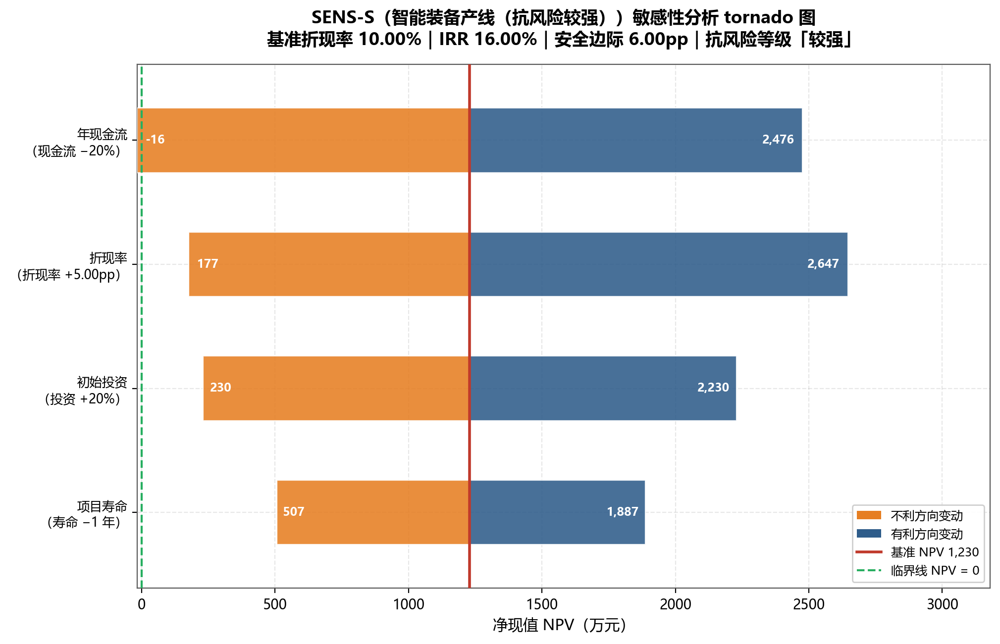

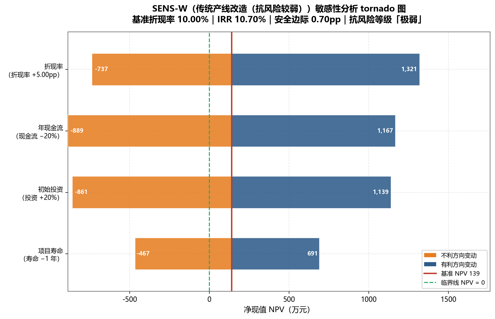

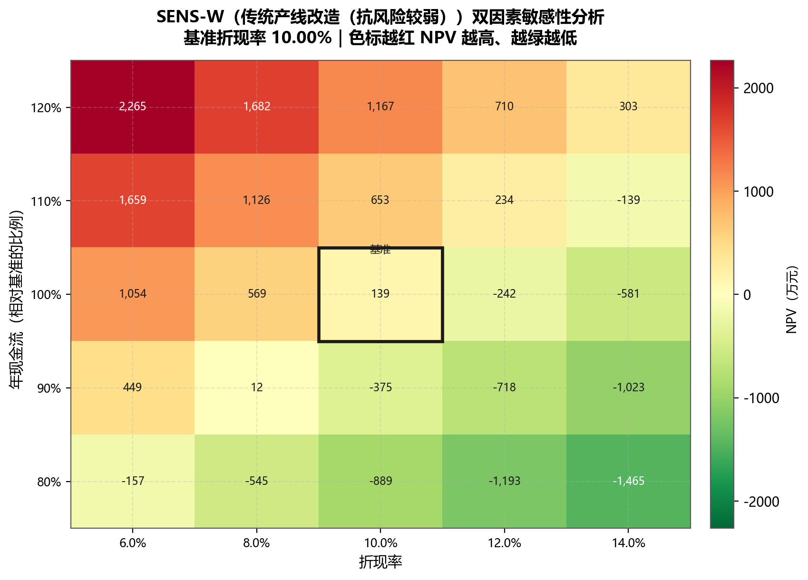

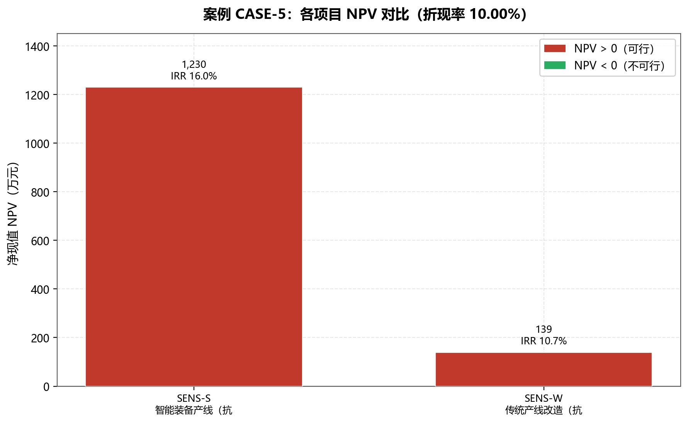

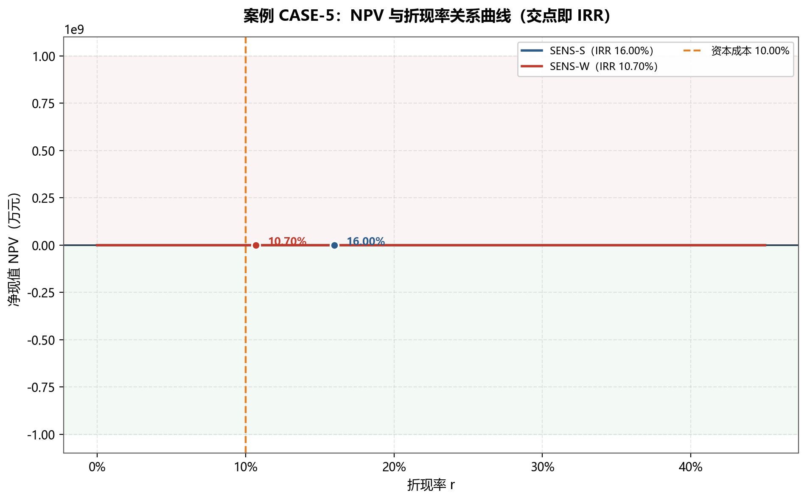

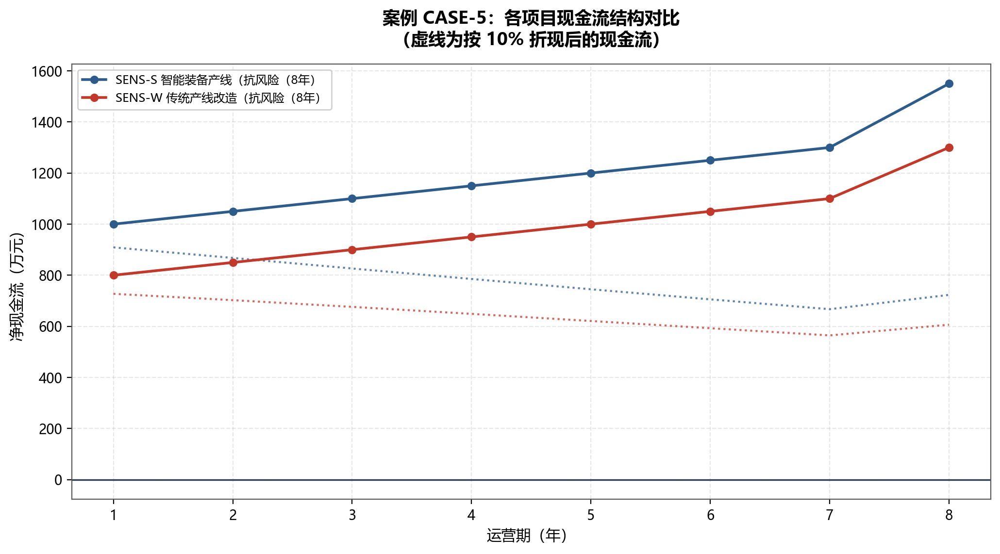


---

## 6. 案例 CASE-6：AI 生成的多行业多周期项目批量评估

**对应知识点**：批量自动化评价；跨行业现金流形态与多重根诊断

基准折现率：**10.00%**｜项目数量：**12 个**

### 项目基础数据

| 项目编号 | 项目名称 | 所属行业 | 初始投资(万元) | 寿命(年) | 风险等级 | 互斥组 | 现金流符号变化次数 |
|:---:|:---:|:---:|:---:|:---:|:---:|:---:|:---:|
| P01 | 新能源项目01 | 新能源（光伏组件制造） | 4,376.44 | 10 | 中高 | - | 1 |
| P02 | 新能源项目02 | 新能源（光伏组件制造） | 4,310.26 | 8 | 中高 | - | 1 |
| P03 | 半导体项目03 | 半导体（晶圆产线） | 8,177.01 | 10 | 高 | - | 1 |
| P04 | 半导体项目04 | 半导体（晶圆产线） | 8,607.23 | 12 | 高 | - | 1 |
| P05 | 生物医药项目05 | 生物医药（创新药研发） | 2,627.30 | 10 | 高 | - | 1 |
| P06 | 生物医药项目06 | 生物医药（创新药研发） | 2,898.42 | 10 | 高 | - | 1 |
| P07 | 消费零售项目07 | 消费零售（连锁门店） | 1,574.71 | 6 | 低 | - | 1 |
| P08 | 消费零售项目08 | 消费零售（连锁门店） | 1,264.87 | 5 | 低 | - | 1 |
| P09 | 公用事业项目09 | 公用事业（城市管网改造） | 3,451.97 | 12 | 低 | - | 1 |
| P10 | 公用事业项目10 | 公用事业（城市管网改造） | 2,989.87 | 14 | 低 | - | 1 |
| P11 | 数字软件项目11 | 数字软件（SaaS 平台） | 1,033.64 | 5 | 中 | - | 1 |
| P12 | 数字软件项目12 | 数字软件（SaaS 平台） | 858.50 | 6 | 中 | - | 1 |

**各期净现金流明细（万元）**

| 项目编号 | 初始投资(万元) | 第1年 | 第2年 | 第3年 | 第4年 | 第5年 | 第6年 | 第7年 | 第8年 | 第9年 | 第10年 | 第11年 | 第12年 | 第13年 | 第14年 |
|:---:|:---:|:---:|:---:|:---:|:---:|:---:|:---:|:---:|:---:|:---:|:---:|:---:|:---:|:---:|:---:|
| P01 | 4,376.44 | 979.75 | 1,305.24 | 1,513.93 | 1,414.59 | 1,674.53 | 1,364.60 | 1,561.34 | 1,638.32 | 1,724.71 | 1,788.01 | - | - | - | - |
| P02 | 4,310.26 | 904.82 | 1,245.24 | 1,532.16 | 1,428.54 | 1,504.22 | 1,394.59 | 1,346.16 | 1,592.76 | - | - | - | - | - | - |
| P03 | 8,177.01 | 1,467.47 | 1,857.14 | 2,201.08 | 2,196.31 | 1,906.57 | 1,528.44 | 1,341.02 | 1,442.06 | 1,468.46 | 2,059.73 | - | - | - | - |
| P04 | 8,607.23 | 1,416.69 | 1,809.79 | 2,040.13 | 1,906.07 | 1,785.58 | 1,771.64 | 1,651.62 | 1,431.07 | 1,401.08 | 1,499.44 | 1,492.85 | 2,009.82 | - | - |
| P05 | 2,627.30 | -335.36 | -319.27 | 270.18 | 861.94 | 1,136.89 | 1,415.19 | 1,594.21 | 2,100.90 | 2,791.98 | 3,329.72 | - | - | - | - |
| P06 | 2,898.42 | -383.90 | -392.32 | 277.19 | 841.21 | 1,179.38 | 1,378.67 | 1,842.45 | 2,227.93 | 2,567.25 | 3,230.37 | - | - | - | - |
| P07 | 1,574.71 | 459.12 | 458.55 | 490.61 | 512.35 | 518.12 | 520.14 | - | - | - | - | - | - | - | - |
| P08 | 1,264.87 | 422.32 | 434.93 | 441.22 | 436.35 | 452.84 | - | - | - | - | - | - | - | - | - |
| P09 | 3,451.97 | 516.02 | 512.54 | 521.92 | 552.13 | 533.45 | 542.49 | 558.60 | 595.44 | 592.98 | 599.33 | 618.53 | 645.03 | - | - |
| P10 | 2,989.87 | 413.08 | 427.92 | 437.57 | 462.10 | 466.12 | 470.98 | 476.30 | 488.10 | 485.74 | 512.68 | 504.13 | 543.66 | 527.33 | 561.97 |
| P11 | 1,033.64 | 304.82 | 457.52 | 607.59 | 532.70 | 650.38 | - | - | - | - | - | - | - | - | - |
| P12 | 858.50 | 305.59 | 374.33 | 502.72 | 495.69 | 581.32 | 468.70 | - | - | - | - | - | - | - | - |

### 全指标评价结果

| 项目编号 | 项目名称 | 所属行业 | 初始投资(万元) | 寿命期(年) | 折现率 | NPV(万元) | IRR | IRR唯一性 | 年金净流量ANCF(万元) | 盈利能力指数PI | 静态回收期(年) | 动态回收期(年) | MIRR | 可行性 |
|:---:|:---:|:---:|:---:|:---:|:---:|:---:|:---:|:---:|:---:|:---:|:---:|:---:|:---:|:---:|
| P01 | 新能源项目01 | 新能源（光伏组件制造） | 4376.44 | 10 | 10.00% | 4492.91 | 28.55% | 唯一 | 731.2 | 2.0266 | 3.41 | 4.29 | 18.05% | 可行 |
| P02 | 新能源项目02 | 新能源（光伏组件制造） | 4310.26 | 8 | 10.00% | 2823.31 | 24.91% | 唯一 | 529.21 | 1.655 | 3.44 | 4.36 | 17.15% | 可行 |
| P03 | 半导体项目03 | 半导体（晶圆产线） | 8177.01 | 10 | 10.00% | 2670.06 | 17.30% | 唯一 | 434.54 | 1.3265 | 4.24 | 6.16 | 13.15% | 可行 |
| P04 | 半导体项目04 | 半导体（晶圆产线） | 8607.23 | 12 | 10.00% | 2970.83 | 16.72% | 唯一 | 436.01 | 1.3452 | 4.8 | 7.05 | 12.75% | 可行 |
| P05 | 生物医药项目05 | 生物医药（创新药研发） | 2627.3 | 10 | 10.00% | 3366.42 | 22.10% | 唯一 | 547.87 | 2.2813 | 5.72 | 7.08 | 18.21% | 可行 |
| P06 | 生物医药项目06 | 生物医药（创新药研发） | 2898.42 | 10 | 10.00% | 3040.71 | 20.32% | 唯一 | 494.86 | 2.0491 | 6.0 | 7.32 | 16.99% | 可行 |
| P07 | 消费零售项目07 | 消费零售（连锁门店） | 1574.71 | 6 | 10.00% | 555.5 | 20.98% | 唯一 | 127.55 | 1.3528 | 3.32 | 4.19 | 15.68% | 可行 |
| P08 | 消费零售项目08 | 消费零售（连锁门店） | 1264.87 | 5 | 10.00% | 389.21 | 21.30% | 唯一 | 102.67 | 1.3077 | 2.92 | 3.64 | 16.06% | 可行 |
| P09 | 公用事业项目09 | 公用事业（城市管网改造） | 3451.97 | 12 | 10.00% | 316.71 | 11.76% | 唯一 | 46.48 | 1.0917 | 6.49 | 10.49 | 10.81% | 可行 |
| P10 | 公用事业项目10 | 公用事业（城市管网改造） | 2989.87 | 14 | 10.00% | 465.4 | 12.62% | 唯一 | 63.18 | 1.1557 | 6.66 | 11.05 | 11.14% | 可行 |
| P11 | 数字软件项目11 | 数字软件（SaaS 平台） | 1033.64 | 5 | 10.00% | 845.75 | 34.79% | 唯一 | 223.11 | 1.8182 | 2.45 | 2.83 | 23.97% | 可行 |
| P12 | 数字软件项目12 | 数字软件（SaaS 平台） | 858.5 | 6 | 10.00% | 1070.46 | 41.87% | 唯一 | 245.79 | 2.2469 | 2.36 | 2.72 | 25.89% | 可行 |

### 敏感性分析

#### P01（新能源项目01）

基准 NPV **4,492.91 万元**｜IRR **28.55%**｜安全边际 **+18.55 个百分点**｜抗风险等级「**强**」

| 影响因素 | 不利变动 | 不利变动后NPV(万元) | 有利变动 | 有利变动后NPV(万元) | NPV波动幅度(万元) | 是否击穿临界点 |
|:---:|:---:|:---:|:---:|:---:|:---:|:---:|
| 折现率 | 折现率 +5.00pp → 15.00% | 2,743.96 | 折现率 −5.00pp → 5.00% | 6,970.39 | 4,226.43 | 否 |
| 年现金流 | 现金流 −20% | 2,719.04 | 现金流 +20% | 6,266.78 | 3,547.74 | 否 |
| 初始投资 | 投资 +20% → 5,252 万元 | 3,617.62 | 投资 −20% → 3,501 万元 | 5,368.20 | 1,750.58 | 否 |
| 项目寿命 | 寿命 −1 年 → 9 年 | 3,803.56 | 寿命 +1 年 → 11 年 | 5,119.60 | 1,316.04 | 否 |

**临界点分析（NPV = 0 的临界条件）**

| 临界项 | 数值 | 含义 |
|:---:|:---:|:---:|
| 临界折现率（= IRR） |  | 折现率超过该值后项目由可行转为不可行 |
| 初始投资上限 | 可上升 0.00% | 投资超支超过该幅度后 NPV 转负 |
| 年现金流下限 | 可下降 0.00% | 现金流下滑超过该幅度后 NPV 转负 |

#### P02（新能源项目02）

基准 NPV **2,823.31 万元**｜IRR **24.91%**｜安全边际 **+14.91 个百分点**｜抗风险等级「**强**」

| 影响因素 | 不利变动 | 不利变动后NPV(万元) | 有利变动 | 有利变动后NPV(万元) | NPV波动幅度(万元) | 是否击穿临界点 |
|:---:|:---:|:---:|:---:|:---:|:---:|:---:|
| 年现金流 | 现金流 −20% | 1,396.60 | 现金流 +20% | 4,250.03 | 2,853.43 | 否 |
| 折现率 | 折现率 +5.00pp → 15.00% | 1,619.84 | 折现率 −5.00pp → 5.00% | 4,433.74 | 2,813.89 | 否 |
| 初始投资 | 投资 +20% → 5,172 万元 | 1,961.26 | 投资 −20% → 3,448 万元 | 3,685.37 | 1,724.10 | 否 |
| 项目寿命 | 寿命 −1 年 → 7 年 | 2,080.28 | 寿命 +1 年 → 9 年 | 3,498.80 | 1,418.52 | 否 |

**临界点分析（NPV = 0 的临界条件）**

| 临界项 | 数值 | 含义 |
|:---:|:---:|:---:|
| 临界折现率（= IRR） |  | 折现率超过该值后项目由可行转为不可行 |
| 初始投资上限 | 可上升 0.00% | 投资超支超过该幅度后 NPV 转负 |
| 年现金流下限 | 可下降 0.00% | 现金流下滑超过该幅度后 NPV 转负 |

#### P03（半导体项目03）

基准 NPV **2,670.06 万元**｜IRR **17.30%**｜安全边际 **+7.30 个百分点**｜抗风险等级「**较强**」

| 影响因素 | 不利变动 | 不利变动后NPV(万元) | 有利变动 | 有利变动后NPV(万元) | NPV波动幅度(万元) | 是否击穿临界点 |
|:---:|:---:|:---:|:---:|:---:|:---:|:---:|
| 折现率 | 折现率 +5.00pp → 15.00% | 717.11 | 折现率 −5.00pp → 5.00% | 5,387.90 | 4,670.79 | 否 |
| 年现金流 | 现金流 −20% | 500.65 | 现金流 +20% | 4,839.47 | 4,338.83 | 否 |
| 初始投资 | 投资 +20% → 9,812 万元 | 1,034.66 | 投资 −20% → 6,542 万元 | 4,305.46 | 3,270.80 | 否 |
| 项目寿命 | 寿命 −1 年 → 9 年 | 1,875.95 | 寿命 +1 年 → 11 年 | 3,391.98 | 1,516.04 | 否 |

**临界点分析（NPV = 0 的临界条件）**

| 临界项 | 数值 | 含义 |
|:---:|:---:|:---:|
| 临界折现率（= IRR） |  | 折现率超过该值后项目由可行转为不可行 |
| 初始投资上限 | 可上升 0.00% | 投资超支超过该幅度后 NPV 转负 |
| 年现金流下限 | 可下降 0.00% | 现金流下滑超过该幅度后 NPV 转负 |

#### P04（半导体项目04）

基准 NPV **2,970.83 万元**｜IRR **16.72%**｜安全边际 **+6.72 个百分点**｜抗风险等级「**较强**」

| 影响因素 | 不利变动 | 不利变动后NPV(万元) | 有利变动 | 有利变动后NPV(万元) | NPV波动幅度(万元) | 是否击穿临界点 |
|:---:|:---:|:---:|:---:|:---:|:---:|:---:|
| 折现率 | 折现率 +5.00pp → 15.00% | 632.20 | 折现率 −5.00pp → 5.00% | 6,393.11 | 5,760.91 | 否 |
| 年现金流 | 现金流 −20% | 655.22 | 现金流 +20% | 5,286.44 | 4,631.22 | 否 |
| 初始投资 | 投资 +20% → 10,329 万元 | 1,249.38 | 投资 −20% → 6,886 万元 | 4,692.28 | 3,442.89 | 否 |
| 项目寿命 | 寿命 −1 年 → 11 年 | 2,330.44 | 寿命 +1 年 → 13 年 | 3,553.00 | 1,222.56 | 否 |

**临界点分析（NPV = 0 的临界条件）**

| 临界项 | 数值 | 含义 |
|:---:|:---:|:---:|
| 临界折现率（= IRR） |  | 折现率超过该值后项目由可行转为不可行 |
| 初始投资上限 | 可上升 0.00% | 投资超支超过该幅度后 NPV 转负 |
| 年现金流下限 | 可下降 0.00% | 现金流下滑超过该幅度后 NPV 转负 |

#### P05（生物医药项目05）

基准 NPV **3,366.42 万元**｜IRR **22.10%**｜安全边际 **+12.10 个百分点**｜抗风险等级「**强**」

| 影响因素 | 不利变动 | 不利变动后NPV(万元) | 有利变动 | 有利变动后NPV(万元) | NPV波动幅度(万元) | 是否击穿临界点 |
|:---:|:---:|:---:|:---:|:---:|:---:|:---:|
| 折现率 | 折现率 +5.00pp → 15.00% | 1,590.02 | 折现率 −5.00pp → 5.00% | 6,051.90 | 4,461.88 | 否 |
| 项目寿命 | 寿命 −1 年 → 9 年 | 2,082.67 | 寿命 +1 年 → 11 年 | 4,533.47 | 2,450.80 | 否 |
| 年现金流 | 现金流 −20% | 2,167.68 | 现金流 +20% | 4,565.17 | 2,397.49 | 否 |
| 初始投资 | 投资 +20% → 3,153 万元 | 2,840.96 | 投资 −20% → 2,102 万元 | 3,891.88 | 1,050.92 | 否 |

**临界点分析（NPV = 0 的临界条件）**

| 临界项 | 数值 | 含义 |
|:---:|:---:|:---:|
| 临界折现率（= IRR） |  | 折现率超过该值后项目由可行转为不可行 |
| 初始投资上限 | 可上升 0.00% | 投资超支超过该幅度后 NPV 转负 |
| 年现金流下限 | 可下降 0.00% | 现金流下滑超过该幅度后 NPV 转负 |

#### P06（生物医药项目06）

基准 NPV **3,040.71 万元**｜IRR **20.32%**｜安全边际 **+10.32 个百分点**｜抗风险等级「**强**」

| 影响因素 | 不利变动 | 不利变动后NPV(万元) | 有利变动 | 有利变动后NPV(万元) | NPV波动幅度(万元) | 是否击穿临界点 |
|:---:|:---:|:---:|:---:|:---:|:---:|:---:|
| 折现率 | 折现率 +5.00pp → 15.00% | 1,265.95 | 折现率 −5.00pp → 5.00% | 5,719.87 | 4,453.92 | 否 |
| 项目寿命 | 寿命 −1 年 → 9 年 | 1,795.27 | 寿命 +1 年 → 11 年 | 4,172.94 | 2,377.67 | 否 |
| 年现金流 | 现金流 −20% | 1,852.89 | 现金流 +20% | 4,228.54 | 2,375.65 | 否 |
| 初始投资 | 投资 +20% → 3,478 万元 | 2,461.03 | 投资 −20% → 2,319 万元 | 3,620.40 | 1,159.37 | 否 |

**临界点分析（NPV = 0 的临界条件）**

| 临界项 | 数值 | 含义 |
|:---:|:---:|:---:|
| 临界折现率（= IRR） |  | 折现率超过该值后项目由可行转为不可行 |
| 初始投资上限 | 可上升 0.00% | 投资超支超过该幅度后 NPV 转负 |
| 年现金流下限 | 可下降 0.00% | 现金流下滑超过该幅度后 NPV 转负 |

#### P07（消费零售项目07）

基准 NPV **555.50 万元**｜IRR **20.98%**｜安全边际 **+10.98 个百分点**｜抗风险等级「**强**」

| 影响因素 | 不利变动 | 不利变动后NPV(万元) | 有利变动 | 有利变动后NPV(万元) | NPV波动幅度(万元) | 是否击穿临界点 |
|:---:|:---:|:---:|:---:|:---:|:---:|:---:|
| 年现金流 | 现金流 −20% | 129.46 | 现金流 +20% | 981.54 | 852.08 | 否 |
| 折现率 | 折现率 +5.00pp → 15.00% | 269.24 | 折现率 −5.00pp → 5.00% | 917.88 | 648.64 | 否 |
| 初始投资 | 投资 +20% → 1,890 万元 | 240.56 | 投资 −20% → 1,260 万元 | 870.44 | 629.88 | 否 |
| 项目寿命 | 寿命 −1 年 → 5 年 | 261.90 | 寿命 +1 年 → 7 年 | 822.41 | 560.52 | 否 |

**临界点分析（NPV = 0 的临界条件）**

| 临界项 | 数值 | 含义 |
|:---:|:---:|:---:|
| 临界折现率（= IRR） |  | 折现率超过该值后项目由可行转为不可行 |
| 初始投资上限 | 可上升 0.00% | 投资超支超过该幅度后 NPV 转负 |
| 年现金流下限 | 可下降 0.00% | 现金流下滑超过该幅度后 NPV 转负 |

#### P08（消费零售项目08）

基准 NPV **389.21 万元**｜IRR **21.30%**｜安全边际 **+11.30 个百分点**｜抗风险等级「**强**」

| 影响因素 | 不利变动 | 不利变动后NPV(万元) | 有利变动 | 有利变动后NPV(万元) | NPV波动幅度(万元) | 是否击穿临界点 |
|:---:|:---:|:---:|:---:|:---:|:---:|:---:|
| 年现金流 | 现金流 −20% | 58.39 | 现金流 +20% | 720.03 | 661.63 | 否 |
| 项目寿命 | 寿命 −1 年 → 4 年 | 108.03 | 寿命 +1 年 → 6 年 | 644.83 | 536.79 | 否 |
| 初始投资 | 投资 +20% → 1,518 万元 | 136.24 | 投资 −20% → 1,012 万元 | 642.18 | 505.95 | 否 |
| 折现率 | 折现率 +5.00pp → 15.00% | 195.97 | 折现率 −5.00pp → 5.00% | 626.77 | 430.80 | 否 |

**临界点分析（NPV = 0 的临界条件）**

| 临界项 | 数值 | 含义 |
|:---:|:---:|:---:|
| 临界折现率（= IRR） |  | 折现率超过该值后项目由可行转为不可行 |
| 初始投资上限 | 可上升 0.00% | 投资超支超过该幅度后 NPV 转负 |
| 年现金流下限 | 可下降 0.00% | 现金流下滑超过该幅度后 NPV 转负 |

#### P09（公用事业项目09）

基准 NPV **316.71 万元**｜IRR **11.76%**｜安全边际 **+1.76 个百分点**｜抗风险等级「**较弱**」

| 影响因素 | 不利变动 | 不利变动后NPV(万元) | 有利变动 | 有利变动后NPV(万元) | NPV波动幅度(万元) | 是否击穿临界点 |
|:---:|:---:|:---:|:---:|:---:|:---:|:---:|
| 折现率 | 折现率 +5.00pp → 15.00% | -482.23 | 折现率 −5.00pp → 5.00% | 1,503.24 | 1,985.48 | ⚠️ 是（NPV 转负） |
| 年现金流 | 现金流 −20% | -437.03 | 现金流 +20% | 1,070.45 | 1,507.47 | ⚠️ 是（NPV 转负） |
| 初始投资 | 投资 +20% → 4,142 万元 | -373.68 | 投资 −20% → 2,762 万元 | 1,007.10 | 1,380.79 | ⚠️ 是（NPV 转负） |
| 项目寿命 | 寿命 −1 年 → 11 年 | 111.18 | 寿命 +1 年 → 13 年 | 503.55 | 392.37 | 否 |

**临界点分析（NPV = 0 的临界条件）**

| 临界项 | 数值 | 含义 |
|:---:|:---:|:---:|
| 临界折现率（= IRR） |  | 折现率超过该值后项目由可行转为不可行 |
| 初始投资上限 | 可上升 0.00% | 投资超支超过该幅度后 NPV 转负 |
| 年现金流下限 | 可下降 0.00% | 现金流下滑超过该幅度后 NPV 转负 |

#### P10（公用事业项目10）

基准 NPV **465.40 万元**｜IRR **12.62%**｜安全边际 **+2.62 个百分点**｜抗风险等级「**较弱**」

| 影响因素 | 不利变动 | 不利变动后NPV(万元) | 有利变动 | 有利变动后NPV(万元) | NPV波动幅度(万元) | 是否击穿临界点 |
|:---:|:---:|:---:|:---:|:---:|:---:|:---:|
| 折现率 | 折现率 +5.00pp → 15.00% | -341.30 | 折现率 −5.00pp → 5.00% | 1,724.19 | 2,065.49 | ⚠️ 是（NPV 转负） |
| 年现金流 | 现金流 −20% | -225.66 | 现金流 +20% | 1,156.45 | 1,382.11 | ⚠️ 是（NPV 转负） |
| 初始投资 | 投资 +20% → 3,588 万元 | -132.58 | 投资 −20% → 2,392 万元 | 1,063.37 | 1,195.95 | ⚠️ 是（NPV 转负） |
| 项目寿命 | 寿命 −1 年 → 13 年 | 317.41 | 寿命 +1 年 → 15 年 | 599.93 | 282.52 | 否 |

**临界点分析（NPV = 0 的临界条件）**

| 临界项 | 数值 | 含义 |
|:---:|:---:|:---:|
| 临界折现率（= IRR） |  | 折现率超过该值后项目由可行转为不可行 |
| 初始投资上限 | 可上升 0.00% | 投资超支超过该幅度后 NPV 转负 |
| 年现金流下限 | 可下降 0.00% | 现金流下滑超过该幅度后 NPV 转负 |

#### P11（数字软件项目11）

基准 NPV **845.75 万元**｜IRR **34.79%**｜安全边际 **+24.79 个百分点**｜抗风险等级「**强**」

| 影响因素 | 不利变动 | 不利变动后NPV(万元) | 有利变动 | 有利变动后NPV(万元) | NPV波动幅度(万元) | 是否击穿临界点 |
|:---:|:---:|:---:|:---:|:---:|:---:|:---:|
| 项目寿命 | 寿命 −1 年 → 4 年 | 441.92 | 寿命 +1 年 → 6 年 | 1,212.87 | 770.96 | 否 |
| 年现金流 | 现金流 −20% | 469.87 | 现金流 +20% | 1,221.63 | 751.76 | 否 |
| 折现率 | 折现率 +5.00pp → 15.00% | 604.80 | 折现率 −5.00pp → 5.00% | 1,144.35 | 539.55 | 否 |
| 初始投资 | 投资 +20% → 1,240 万元 | 639.02 | 投资 −20% → 827 万元 | 1,052.48 | 413.46 | 否 |

**临界点分析（NPV = 0 的临界条件）**

| 临界项 | 数值 | 含义 |
|:---:|:---:|:---:|
| 临界折现率（= IRR） |  | 折现率超过该值后项目由可行转为不可行 |
| 初始投资上限 | 可上升 0.00% | 投资超支超过该幅度后 NPV 转负 |
| 年现金流下限 | 可下降 0.00% | 现金流下滑超过该幅度后 NPV 转负 |

#### P12（数字软件项目12）

基准 NPV **1,070.46 万元**｜IRR **41.87%**｜安全边际 **+31.87 个百分点**｜抗风险等级「**强**」

| 影响因素 | 不利变动 | 不利变动后NPV(万元) | 有利变动 | 有利变动后NPV(万元) | NPV波动幅度(万元) | 是否击穿临界点 |
|:---:|:---:|:---:|:---:|:---:|:---:|:---:|
| 年现金流 | 现金流 −20% | 684.67 | 现金流 +20% | 1,456.25 | 771.58 | 否 |
| 折现率 | 折现率 +5.00pp → 15.00% | 795.89 | 折现率 −5.00pp → 5.00% | 1,419.37 | 623.48 | 否 |
| 项目寿命 | 寿命 −1 年 → 5 年 | 805.89 | 寿命 +1 年 → 7 年 | 1,310.98 | 505.09 | 否 |
| 初始投资 | 投资 +20% → 1,030 万元 | 898.76 | 投资 −20% → 687 万元 | 1,242.16 | 343.40 | 否 |

**临界点分析（NPV = 0 的临界条件）**

| 临界项 | 数值 | 含义 |
|:---:|:---:|:---:|
| 临界折现率（= IRR） |  | 折现率超过该值后项目由可行转为不可行 |
| 初始投资上限 | 可上升 0.00% | 投资超支超过该幅度后 NPV 转负 |
| 年现金流下限 | 可下降 0.00% | 现金流下滑超过该幅度后 NPV 转负 |

**折现率敏感性明细（以首个项目为例）**

| 折现率 | 折现率变动 | NPV(万元) | 相对基准变动(万元) | 可行性 |
|:---:|:---:|:---:|:---:|:---:|
| 6.00% | -4.00% | 6399.97 | 1907.06 | 可行 |
| 7.00% | -3.00% | 5870.37 | 1377.46 | 可行 |
| 8.00% | -2.00% | 5378.07 | 885.16 | 可行 |
| 9.00% | -1.00% | 4919.87 | 426.96 | 可行 |
| 10.00% | 基准 | 4492.91 | 0.0 | 可行 |
| 11.00% | +1.00% | 4094.59 | -398.32 | 可行 |
| 12.00% | +2.00% | 3722.57 | -770.34 | 可行 |
| 13.00% | +3.00% | 3374.72 | -1118.2 | 可行 |
| 14.00% | +4.00% | 3049.1 | -1443.81 | 可行 |
| 15.00% | +5.00% | 2743.96 | -1748.95 | 可行 |

### AI 辅助决策建议

#### P01｜新能源项目01

**结论：可行（推荐投资）**　（风险评分：0/100　文案通道：规则引擎）

> P01（新能源项目01）NPV 为 4,493 万元，IRR 为 28.55%（高于资本成本 10.0%），抗风险能力强，建议按计划推进。

**决策依据**

- 净现值 NPV = **4,492.91 万元**（折现率 10.00%，初始投资 4,376 万元，寿命 10 年），大于零，项目创造价值。
- 内含报酬率 IRR = **28.55%**，高于资本成本 10.00%，安全边际 +18.55 个百分点，抗风险等级「强」。
- 盈利能力指数 PI = **2.0266**，年金净流量 ANCF = **731.20 万元/年**，修正内部收益率 MIRR = 18.05%。
- 静态投资回收期 **3.41 年**（占寿命 34%），动态投资回收期 **4.29 年**。

**风险点提示**

- **折现率风险（可控）**：折现率上升 5 个百分点至 15.00% 时，NPV 仍为 +2,743.96 万元，距临界折现率（IRR 28.55%）尚有 18.55 个百分点缓冲。
- **投资超支风险（低）**：初始投资可承受最大超支 102.66%，预算弹性充足。
- **收入下滑风险（低）**：年现金流可承受 50.66% 的降幅，对市场波动的缓冲较厚。

**建议动作**

- **按计划推进**：NPV 与 IRR 双指标通过，安全边际充足。
- **重点监控最敏感因素「折现率」**：该因素波动对 NPV 的影响最大（±20% 扰动引起 NPV 变动 4,226.43 万元），应在项目执行中建立该指标的月度跟踪机制。
- 建议纳入投资组合整体安排，与其他项目在时间与行业上形成分散配置。

#### P02｜新能源项目02

**结论：可行（推荐投资）**　（风险评分：0/100　文案通道：规则引擎）

> P02（新能源项目02）NPV 为 2,823 万元，IRR 为 24.91%（高于资本成本 10.0%），抗风险能力强，建议按计划推进。

**决策依据**

- 净现值 NPV = **2,823.31 万元**（折现率 10.00%，初始投资 4,310 万元，寿命 8 年），大于零，项目创造价值。
- 内含报酬率 IRR = **24.91%**，高于资本成本 10.00%，安全边际 +14.91 个百分点，抗风险等级「强」。
- 盈利能力指数 PI = **1.6550**，年金净流量 ANCF = **529.21 万元/年**，修正内部收益率 MIRR = 17.15%。
- 静态投资回收期 **3.44 年**（占寿命 43%），动态投资回收期 **4.36 年**。

**风险点提示**

- **折现率风险（可控）**：折现率上升 5 个百分点至 15.00% 时，NPV 仍为 +1,619.84 万元，距临界折现率（IRR 24.91%）尚有 14.91 个百分点缓冲。
- **投资超支风险（低）**：初始投资可承受最大超支 65.50%，预算弹性充足。
- **收入下滑风险（低）**：年现金流可承受 39.58% 的降幅，对市场波动的缓冲较厚。

**建议动作**

- **按计划推进**：NPV 与 IRR 双指标通过，安全边际充足。
- **重点监控最敏感因素「年现金流」**：该因素波动对 NPV 的影响最大（±20% 扰动引起 NPV 变动 2,853.43 万元），应在项目执行中建立该指标的月度跟踪机制。
- 建议纳入投资组合整体安排，与其他项目在时间与行业上形成分散配置。

#### P03｜半导体项目03

**结论：可行（推荐投资）**　（风险评分：7/100　文案通道：规则引擎）

> P03（半导体项目03）NPV 为 2,670 万元，IRR 为 17.30%（高于资本成本 10.0%），抗风险能力较强，建议按计划推进。

**决策依据**

- 净现值 NPV = **2,670.06 万元**（折现率 10.00%，初始投资 8,177 万元，寿命 10 年），大于零，项目创造价值。
- 内含报酬率 IRR = **17.30%**，高于资本成本 10.00%，安全边际 +7.30 个百分点，抗风险等级「较强」。
- 盈利能力指数 PI = **1.3265**，年金净流量 ANCF = **434.54 万元/年**，修正内部收益率 MIRR = 13.15%。
- 静态投资回收期 **4.24 年**（占寿命 42%），动态投资回收期 **6.16 年**。

**风险点提示**

- **折现率风险（可控）**：折现率上升 5 个百分点至 15.00% 时，NPV 仍为 +717.11 万元，距临界折现率（IRR 17.30%）尚有 7.30 个百分点缓冲。
- **投资超支风险（中）**：初始投资可承受的最大超支幅度为 32.65%（临界值 10,847 万元），建议在预算中预留不低于 10% 的不可预见费。
- **收入下滑风险（中）**：年现金流最大可下降 24.62%，低于此幅度 NPV 转负，需锁定核心客户与长期订单。

**建议动作**

- **按计划推进**：NPV 与 IRR 双指标通过，安全边际充足。
- **重点监控最敏感因素「折现率」**：该因素波动对 NPV 的影响最大（±20% 扰动引起 NPV 变动 4,670.79 万元），应在项目执行中建立该指标的月度跟踪机制。
- 建议纳入投资组合整体安排，与其他项目在时间与行业上形成分散配置。

#### P04｜半导体项目04

**结论：可行（推荐投资）**　（风险评分：7/100　文案通道：规则引擎）

> P04（半导体项目04）NPV 为 2,971 万元，IRR 为 16.72%（高于资本成本 10.0%），抗风险能力较强，建议按计划推进。

**决策依据**

- 净现值 NPV = **2,970.83 万元**（折现率 10.00%，初始投资 8,607 万元，寿命 12 年），大于零，项目创造价值。
- 内含报酬率 IRR = **16.72%**，高于资本成本 10.00%，安全边际 +6.72 个百分点，抗风险等级「较强」。
- 盈利能力指数 PI = **1.3452**，年金净流量 ANCF = **436.01 万元/年**，修正内部收益率 MIRR = 12.75%。
- 静态投资回收期 **4.80 年**（占寿命 40%），动态投资回收期 **7.05 年**。

**风险点提示**

- **折现率风险（可控）**：折现率上升 5 个百分点至 15.00% 时，NPV 仍为 +632.20 万元，距临界折现率（IRR 16.72%）尚有 6.72 个百分点缓冲。
- **投资超支风险（中）**：初始投资可承受的最大超支幅度为 34.52%（临界值 11,578 万元），建议在预算中预留不低于 10% 的不可预见费。
- **收入下滑风险（低）**：年现金流可承受 25.66% 的降幅，对市场波动的缓冲较厚。

**建议动作**

- **按计划推进**：NPV 与 IRR 双指标通过，安全边际充足。
- **重点监控最敏感因素「折现率」**：该因素波动对 NPV 的影响最大（±20% 扰动引起 NPV 变动 5,760.91 万元），应在项目执行中建立该指标的月度跟踪机制。
- 建议纳入投资组合整体安排，与其他项目在时间与行业上形成分散配置。

#### P05｜生物医药项目05

**结论：可行（推荐投资）**　（风险评分：10/100　文案通道：规则引擎）

> P05（生物医药项目05）NPV 为 3,366 万元，IRR 为 22.10%（高于资本成本 10.0%），抗风险能力强，建议按计划推进。

**决策依据**

- 净现值 NPV = **3,366.42 万元**（折现率 10.00%，初始投资 2,627 万元，寿命 10 年），大于零，项目创造价值。
- 内含报酬率 IRR = **22.10%**，高于资本成本 10.00%，安全边际 +12.10 个百分点，抗风险等级「强」。
- 盈利能力指数 PI = **2.2813**，年金净流量 ANCF = **547.87 万元/年**，修正内部收益率 MIRR = 18.21%。
- 静态投资回收期 **5.72 年**（占寿命 57%），动态投资回收期 **7.08 年**。

**风险点提示**

- **折现率风险（可控）**：折现率上升 5 个百分点至 15.00% 时，NPV 仍为 +1,590.02 万元，距临界折现率（IRR 22.10%）尚有 12.10 个百分点缓冲。
- **投资超支风险（低）**：初始投资可承受最大超支 128.13%，预算弹性充足。
- **收入下滑风险（低）**：年现金流可承受 56.17% 的降幅，对市场波动的缓冲较厚。
- **经营波动风险（中高）**：各期现金流变异系数 0.91（91%），现金流分布离散度高，收入预测的不确定性较大。

**建议动作**

- **按计划推进**：NPV 与 IRR 双指标通过，安全边际充足。
- **重点监控最敏感因素「折现率」**：该因素波动对 NPV 的影响最大（±20% 扰动引起 NPV 变动 4,461.88 万元），应在项目执行中建立该指标的月度跟踪机制。
- 建议纳入投资组合整体安排，与其他项目在时间与行业上形成分散配置。

#### P06｜生物医药项目06

**结论：可行（推荐投资）**　（风险评分：10/100　文案通道：规则引擎）

> P06（生物医药项目06）NPV 为 3,041 万元，IRR 为 20.32%（高于资本成本 10.0%），抗风险能力强，建议按计划推进。

**决策依据**

- 净现值 NPV = **3,040.71 万元**（折现率 10.00%，初始投资 2,898 万元，寿命 10 年），大于零，项目创造价值。
- 内含报酬率 IRR = **20.32%**，高于资本成本 10.00%，安全边际 +10.32 个百分点，抗风险等级「强」。
- 盈利能力指数 PI = **2.0491**，年金净流量 ANCF = **494.86 万元/年**，修正内部收益率 MIRR = 16.99%。
- 静态投资回收期 **6.00 年**（占寿命 60%），动态投资回收期 **7.32 年**。

**风险点提示**

- **折现率风险（可控）**：折现率上升 5 个百分点至 15.00% 时，NPV 仍为 +1,265.95 万元，距临界折现率（IRR 20.32%）尚有 10.32 个百分点缓冲。
- **投资超支风险（低）**：初始投资可承受最大超支 104.91%，预算弹性充足。
- **收入下滑风险（低）**：年现金流可承受 51.20% 的降幅，对市场波动的缓冲较厚。
- **经营波动风险（中高）**：各期现金流变异系数 0.91（91%），现金流分布离散度高，收入预测的不确定性较大。

**建议动作**

- **按计划推进**：NPV 与 IRR 双指标通过，安全边际充足。
- **重点监控最敏感因素「折现率」**：该因素波动对 NPV 的影响最大（±20% 扰动引起 NPV 变动 4,453.92 万元），应在项目执行中建立该指标的月度跟踪机制。
- 建议纳入投资组合整体安排，与其他项目在时间与行业上形成分散配置。

#### P07｜消费零售项目07

**结论：可行（推荐投资）**　（风险评分：0/100　文案通道：规则引擎）

> P07（消费零售项目07）NPV 为 556 万元，IRR 为 20.98%（高于资本成本 10.0%），抗风险能力强，建议按计划推进。

**决策依据**

- 净现值 NPV = **555.50 万元**（折现率 10.00%，初始投资 1,575 万元，寿命 6 年），大于零，项目创造价值。
- 内含报酬率 IRR = **20.98%**，高于资本成本 10.00%，安全边际 +10.98 个百分点，抗风险等级「强」。
- 盈利能力指数 PI = **1.3528**，年金净流量 ANCF = **127.55 万元/年**，修正内部收益率 MIRR = 15.68%。
- 静态投资回收期 **3.32 年**（占寿命 55%），动态投资回收期 **4.19 年**。

**风险点提示**

- **折现率风险（可控）**：折现率上升 5 个百分点至 15.00% 时，NPV 仍为 +269.24 万元，距临界折现率（IRR 20.98%）尚有 10.98 个百分点缓冲。
- **投资超支风险（低）**：初始投资可承受最大超支 35.28%，预算弹性充足。
- **收入下滑风险（低）**：年现金流可承受 26.08% 的降幅，对市场波动的缓冲较厚。

**建议动作**

- **按计划推进**：NPV 与 IRR 双指标通过，安全边际充足。
- **重点监控最敏感因素「年现金流」**：该因素波动对 NPV 的影响最大（±20% 扰动引起 NPV 变动 852.08 万元），应在项目执行中建立该指标的月度跟踪机制。
- 建议纳入投资组合整体安排，与其他项目在时间与行业上形成分散配置。

#### P08｜消费零售项目08

**结论：可行（推荐投资）**　（风险评分：0/100　文案通道：规则引擎）

> P08（消费零售项目08）NPV 为 389 万元，IRR 为 21.30%（高于资本成本 10.0%），抗风险能力强，建议按计划推进。

**决策依据**

- 净现值 NPV = **389.21 万元**（折现率 10.00%，初始投资 1,265 万元，寿命 5 年），大于零，项目创造价值。
- 内含报酬率 IRR = **21.30%**，高于资本成本 10.00%，安全边际 +11.30 个百分点，抗风险等级「强」。
- 盈利能力指数 PI = **1.3077**，年金净流量 ANCF = **102.67 万元/年**，修正内部收益率 MIRR = 16.06%。
- 静态投资回收期 **2.92 年**（占寿命 58%），动态投资回收期 **3.64 年**。

**风险点提示**

- **折现率风险（可控）**：折现率上升 5 个百分点至 15.00% 时，NPV 仍为 +195.97 万元，距临界折现率（IRR 21.30%）尚有 11.30 个百分点缓冲。
- **投资超支风险（中）**：初始投资可承受的最大超支幅度为 30.77%（临界值 1,654 万元），建议在预算中预留不低于 10% 的不可预见费。
- **收入下滑风险（中）**：年现金流最大可下降 23.53%，低于此幅度 NPV 转负，需锁定核心客户与长期订单。

**建议动作**

- **按计划推进**：NPV 与 IRR 双指标通过，安全边际充足。
- **重点监控最敏感因素「年现金流」**：该因素波动对 NPV 的影响最大（±20% 扰动引起 NPV 变动 661.63 万元），应在项目执行中建立该指标的月度跟踪机制。
- 建议纳入投资组合整体安排，与其他项目在时间与行业上形成分散配置。

#### P09｜公用事业项目09

**结论：可行但安全边际不足（谨慎推进）**　（风险评分：44/100　文案通道：规则引擎）

> P09（公用事业项目09）NPV 为 317 万元，但 IRR 11.76% 仅高于资本成本 1.76 个百分点，安全边际偏薄，属于边缘可行项目。

**决策依据**

- 净现值 NPV = **316.71 万元**（折现率 10.00%，初始投资 3,452 万元，寿命 12 年），大于零，项目创造价值。
- 内含报酬率 IRR = **11.76%**，高于资本成本 10.00%，安全边际 +1.76 个百分点，抗风险等级「较弱」。
- 盈利能力指数 PI = **1.0917**，年金净流量 ANCF = **46.48 万元/年**，修正内部收益率 MIRR = 10.81%。
- 静态投资回收期 **6.49 年**（占寿命 54%），动态投资回收期 **10.49 年**。

**风险点提示**

- **折现率上升风险（高）**：折现率上升 5 个百分点至 15.00% 时，项目 NPV 由 +316.71 万元转为 -482.23 万元，**由正转负**，抗风险能力较弱（IRR 仅 11.76%，安全边际 1.76pp）。若宏观利率上行或资本成本重估，项目将立即失效。
- **投资超支风险（高）**：初始投资最多只能上升 **9.17%**（临界值 3,769 万元），工程超支、建设期延长的容错空间极小。
- **收入下滑风险（高）**：年现金流最大可下降 **8.40%**，即年均现金流低于 518 万元时 NPV 转为负值。该缓冲幅度低于行业常见的收入波动区间，项目对市场需求变化极为敏感。

**建议动作**

- **分期投入、设置退出机制**：将投资拆分为 2~3 期，每期结束后按实测现金流复核是否继续。
- **锁定收益端不确定性**：签订长期供货/服务合同，压低现金流波动。
- 设置折现率红线：资本成本一旦超过 11.76%，立即停止后续投入。

#### P10｜公用事业项目10

**结论：可行但安全边际不足（谨慎推进）**　（风险评分：44/100　文案通道：规则引擎）

> P10（公用事业项目10）NPV 为 465 万元，但 IRR 12.62% 仅高于资本成本 2.62 个百分点，安全边际偏薄，属于边缘可行项目。

**决策依据**

- 净现值 NPV = **465.40 万元**（折现率 10.00%，初始投资 2,990 万元，寿命 14 年），大于零，项目创造价值。
- 内含报酬率 IRR = **12.62%**，高于资本成本 10.00%，安全边际 +2.62 个百分点，抗风险等级「较弱」。
- 盈利能力指数 PI = **1.1557**，年金净流量 ANCF = **63.18 万元/年**，修正内部收益率 MIRR = 11.14%。
- 静态投资回收期 **6.66 年**（占寿命 48%），动态投资回收期 **11.05 年**。

**风险点提示**

- **折现率上升风险（高）**：折现率上升 5 个百分点至 15.00% 时，项目 NPV 由 +465.40 万元转为 -341.30 万元，**由正转负**，抗风险能力较弱（IRR 仅 12.62%，安全边际 2.62pp）。若宏观利率上行或资本成本重估，项目将立即失效。
- **投资超支风险（中）**：初始投资可承受的最大超支幅度为 15.57%（临界值 3,455 万元），建议在预算中预留不低于 10% 的不可预见费。
- **收入下滑风险（中）**：年现金流最大可下降 13.47%，低于此幅度 NPV 转负，需锁定核心客户与长期订单。

**建议动作**

- **分期投入、设置退出机制**：将投资拆分为 2~3 期，每期结束后按实测现金流复核是否继续。
- **锁定收益端不确定性**：签订长期供货/服务合同，压低现金流波动。
- 设置折现率红线：资本成本一旦超过 12.62%，立即停止后续投入。

#### P11｜数字软件项目11

**结论：可行（推荐投资）**　（风险评分：3/100　文案通道：规则引擎）

> P11（数字软件项目11）NPV 为 846 万元，IRR 为 34.79%（高于资本成本 10.0%），抗风险能力强，建议按计划推进。

**决策依据**

- 净现值 NPV = **845.75 万元**（折现率 10.00%，初始投资 1,034 万元，寿命 5 年），大于零，项目创造价值。
- 内含报酬率 IRR = **34.79%**，高于资本成本 10.00%，安全边际 +24.79 个百分点，抗风险等级「强」。
- 盈利能力指数 PI = **1.8182**，年金净流量 ANCF = **223.11 万元/年**，修正内部收益率 MIRR = 23.97%。
- 静态投资回收期 **2.45 年**（占寿命 49%），动态投资回收期 **2.83 年**。

**风险点提示**

- **折现率风险（可控）**：折现率上升 5 个百分点至 15.00% 时，NPV 仍为 +604.80 万元，距临界折现率（IRR 34.79%）尚有 24.79 个百分点缓冲。
- **投资超支风险（低）**：初始投资可承受最大超支 81.82%，预算弹性充足。
- **收入下滑风险（低）**：年现金流可承受 45.00% 的降幅，对市场波动的缓冲较厚。

**建议动作**

- **按计划推进**：NPV 与 IRR 双指标通过，安全边际充足。
- **重点监控最敏感因素「项目寿命」**：该因素波动对 NPV 的影响最大（±20% 扰动引起 NPV 变动 770.96 万元），应在项目执行中建立该指标的月度跟踪机制。
- 建议纳入投资组合整体安排，与其他项目在时间与行业上形成分散配置。

#### P12｜数字软件项目12

**结论：可行（推荐投资）**　（风险评分：0/100　文案通道：规则引擎）

> P12（数字软件项目12）NPV 为 1,070 万元，IRR 为 41.87%（高于资本成本 10.0%），抗风险能力强，建议按计划推进。

**决策依据**

- 净现值 NPV = **1,070.46 万元**（折现率 10.00%，初始投资 858 万元，寿命 6 年），大于零，项目创造价值。
- 内含报酬率 IRR = **41.87%**，高于资本成本 10.00%，安全边际 +31.87 个百分点，抗风险等级「强」。
- 盈利能力指数 PI = **2.2469**，年金净流量 ANCF = **245.79 万元/年**，修正内部收益率 MIRR = 25.89%。
- 静态投资回收期 **2.36 年**（占寿命 39%），动态投资回收期 **2.72 年**。

**风险点提示**

- **折现率风险（可控）**：折现率上升 5 个百分点至 15.00% 时，NPV 仍为 +795.89 万元，距临界折现率（IRR 41.87%）尚有 31.87 个百分点缓冲。
- **投资超支风险（低）**：初始投资可承受最大超支 124.69%，预算弹性充足。
- **收入下滑风险（低）**：年现金流可承受 55.49% 的降幅，对市场波动的缓冲较厚。

**建议动作**

- **按计划推进**：NPV 与 IRR 双指标通过，安全边际充足。
- **重点监控最敏感因素「年现金流」**：该因素波动对 NPV 的影响最大（±20% 扰动引起 NPV 变动 771.58 万元），应在项目执行中建立该指标的月度跟踪机制。
- 建议纳入投资组合整体安排，与其他项目在时间与行业上形成分散配置。

### 案例图表

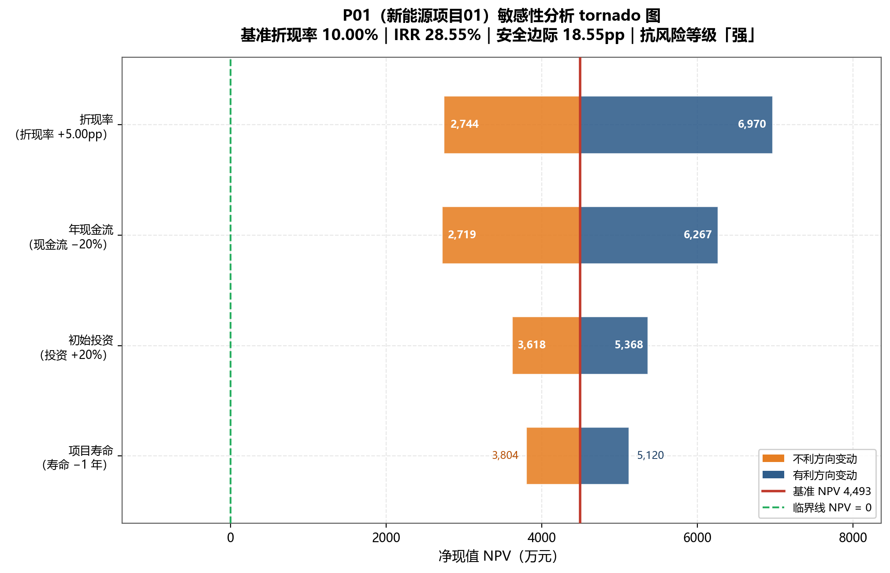

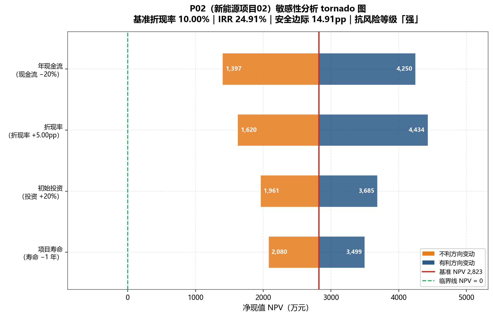

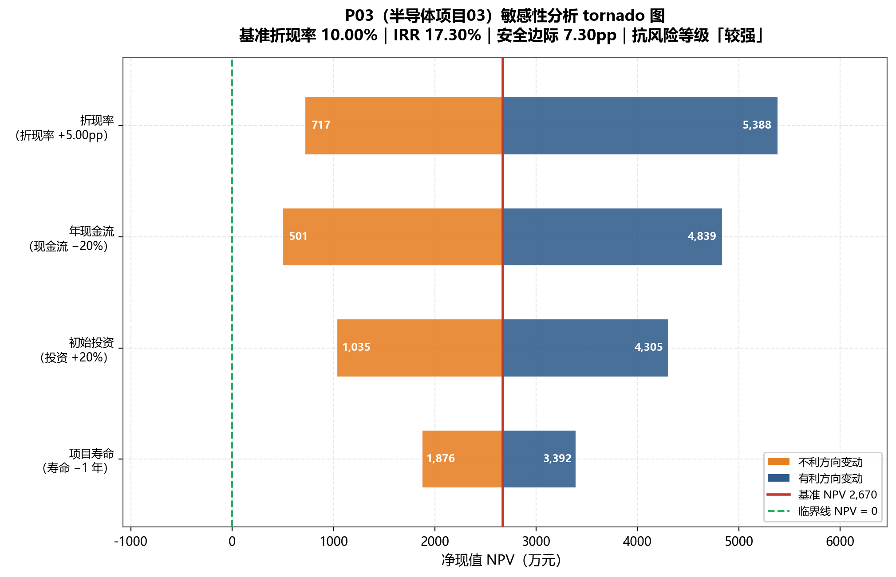

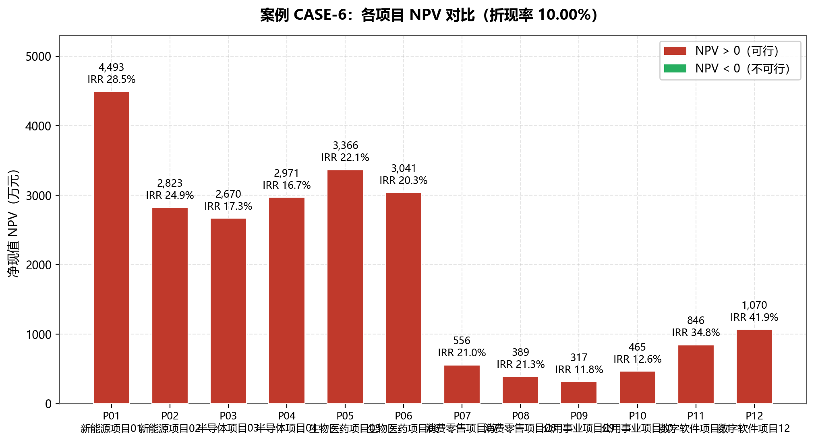

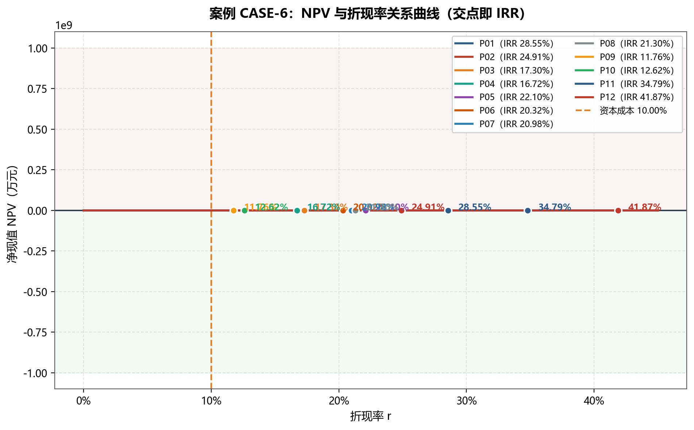


---

## 四、附录

### 附录 A　AI 数据生成的行业原型参数表

下表为 :mod:`src.ai_data_generator` 中 6 个行业的参数区间，CASE-6 的 12 个项目即由这些原型采样生成（固定随机种子，结果可复现）。

| 行业原型 | 投资规模区间(万元) | 寿命区间(年) | 现金回收效率 | 成长率 | 波动率 | 现金流形态 | 风险等级 |
|:---:|:---:|:---:|:---:|:---:|:---:|:---:|:---:|
| 新能源（光伏组件制造） | 3,800 ~ 5,200 | 8 ~ 10 | 20% ~ 26% | 5.0% | 6.0% | 成长型 | 中高 |
| 半导体（晶圆产线） | 6,000 ~ 9,000 | 10 ~ 12 | 16% ~ 21% | 3.0% | 9.0% | 周期型 | 高 |
| 生物医药（创新药研发） | 2,200 ~ 3,000 | 9 ~ 10 | 24% ~ 30% | 8.0% | 10.0% | J 曲线型 | 高 |
| 消费零售（连锁门店） | 900 ~ 1,600 | 5 ~ 6 | 28% ~ 34% | 3.0% | 5.0% | 稳定型 | 低 |
| 公用事业（城市管网改造） | 2,800 ~ 3,600 | 12 ~ 15 | 13% ~ 16% | 2.0% | 3.0% | 稳定型 | 低 |
| 数字软件（SaaS 平台） | 700 ~ 1,200 | 5 ~ 7 | 30% ~ 38% | 10.0% | 8.0% | 成长型 | 中 |

### 附录 B　程序包目录结构

```
investment_decision_system/
├── main.py                        主程序（一键全流程）
├── requirements.txt               依赖清单（实测版本 + 区间上限）
├── pyproject.toml                 工程配置（ruff lint / mypy 类型检查）
├── README.md                      使用说明
├── src/
│   ├── __init__.py                包说明与模块导航
│   ├── config.py                  路径/字体/配色/参数配置
│   ├── finance_core.py            NPV、IRR、ANCF、PI、回收期、MIRR、增量IRR
│   ├── models.py                  Project / Evaluation 数据结构
│   ├── ai_data_generator.py       AI 生成多行业多周期现金流数据
│   ├── scenarios.py               6 个教学测试案例
│   ├── optimizer.py               互斥优选 + 资本限额组合优化
│   ├── sensitivity.py             敏感性分析与临界点分析
│   ├── ai_advisor.py              AI 决策建议生成
│   ├── visualizer.py              图表绘制
│   └── report_generator.py        Markdown / Word 报告导出
├── tests/
│   ├── __init__.py                测试包标识
│   └── test_all.py                单元测试与案例断言
├── tools/
│   └── publish_docs.py            把 outputs/ 定稿产物发布到 docs/
├── docs/                          交付资产（纳入版本库）
│   ├── README.md                  交付资产说明与更新流程
│   ├── 投资项目决策评价报告.md
│   ├── 投资项目决策评价报告.docx
│   ├── figures/                   全部图表 PNG
│   └── data/                      projects.csv / evaluations.csv
└── outputs/                       运行产物（每次运行覆写，不入版本库）
    ├── data/                      数据 CSV
    ├── figures/                   图表 PNG
    └── reports/                   报告 Markdown / Word
```

### 附录 C　环境依赖与复现方式

```bash
# 1. 安装依赖
pip install -r requirements.txt

# 2. 运行全部案例
python main.py --rate 0.10

# 3. 运行单元测试（校验 6 个案例的 68 项断言）
python -m tests.test_all
```

依赖版本：Python ≥ 3.9（实测 3.9.13）、numpy ≥ 1.24,<3、scipy ≥ 1.10,<2、pandas ≥ 2.0,<3、matplotlib ≥ 3.7,<4、python-docx ≥ 1.1,<2。
